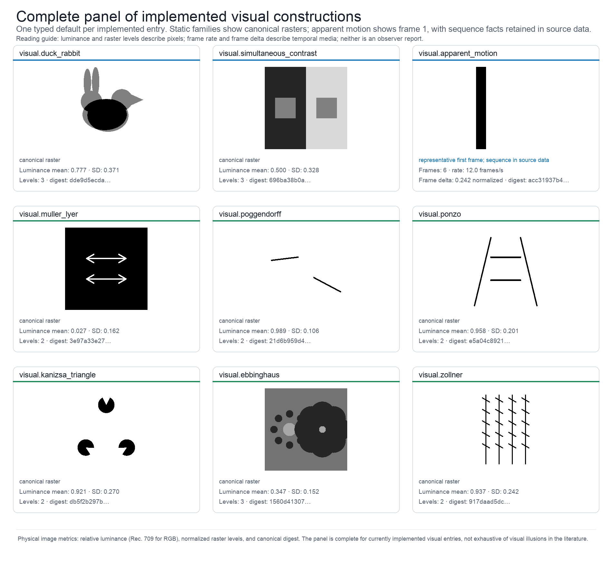

# Results {#sec:results}

## Generated catalog, metrics, and outputs

The live registry reports {{IMPLEMENTED_GENERATORS}} implemented generators,
{{CATALOG_ENTRIES}} catalog entries, {{EVIDENCE_RECORDS}} evidence records, and
{{SCHOLARLY_SOURCES}} source records in the checked-in scholarship audit
snapshot. The complete catalog is
generated in Appendix A rather than copied into prose. The companion figure
keeps the categorical registry, source namespace, and implementation statuses
visible at a glance.

{#fig:catalog_matrix}

{{FIGURE_CAPTION_CATALOG_MATRIX}}

The complete catalog matrix [@fig:catalog_matrix] is tabulated in the standalone
Appendix A [@sec:appendix_catalog; @tbl:catalog]. The corresponding
machine-readable evidence matrix records the source role, exact supported claim,
engineering departure, and limitation for every entry. Keeping the table in an
appendix gives the main results narrative room to explain the contract without
turning a mutable registry snapshot into a prose claim.

## Typed domains and delivery profiles

| Type | Unit | Validated domain | Role |
|---|---|---|---|
{{PARAMETER_TABLE_ROWS}}

: Typed parameter domains and units. {#tbl:parameters}

The parameter contracts are summarized in [@tbl:parameters]. They constrain
physical construction and serialization; they are not psychophysical scales.

| Format | Backend | Artifact | Profile | Status |
|---|---|---|---|---|
{{ENCODING_TABLE_ROWS}}

: Encoding profiles and backend capabilities. {#tbl:encodings}

The delivery profiles are summarized in [@tbl:encodings]. Backend availability
is environment-dependent and is recorded at generation time.

The catalog distinguishes a physical construction from an observer claim. For
example, the sound-induced-flash generator establishes one flash and one or two
beep events on a shared clock; it does not establish a reported flash count.
Similarly, the temporal-ventriloquism generator exposes a declared timing
offset, while the literature reports observer-dependent temporal judgments
under specific tasks and timing conditions [@vroomen2004temporal].

## Pipeline and provenance

{#fig:architecture}

{{FIGURE_CAPTION_ARCHITECTURE}}

The generated architecture figure [@fig:architecture] shows the separation between request,
canonical artifact, delivery adapter, decoded inspection, and manifest. The
canonical digest is the identity of the in-memory stimulus; an encoded hash is
the identity of the delivered file. The difference is intentional.

## Visual constructions and parameter sweeps

{#fig:visual_panel}

{{FIGURE_CAPTION_VISUAL_PANEL}}

The visual panel [@fig:visual_panel] is deliberately a coverage figure: it
contains one deterministic representative for every currently implemented
visual entry, including apparent motion and Zöllner in addition to the static
ambiguous-figure, contrast, geometric-context, illusory-contour, and contextual-
size families. Equalities, masks, line geometry, luminance bounds, and temporal
positions are properties of the typed rasters or sequences. They are not
observer scores, and the gallery is not an exhaustive ontology of visual
illusions.

{#fig:visual_sweep}

{{FIGURE_CAPTION_VISUAL_SWEEP}}

The sweep [@fig:visual_sweep] varies duck-weight from 0 to 1 and jointly varies representable
grayscale and quantization levels. The source data preserve canonical digests
and unique-value counts; no perceptual score is assigned to a sweep cell.

## Temporal and auditory constructions

{#fig:temporal_sequence}

{{FIGURE_CAPTION_TEMPORAL_SEQUENCE}}

The temporal figure [@fig:temporal_sequence] reports frame succession, rational frame rate, and
frame-to-frame mean absolute differences. These facts establish temporal
structure in the file, not the presence or strength of perceived motion.

{#fig:audio_signals}

{{FIGURE_CAPTION_AUDIO_SIGNALS}}

The auditory figure [@fig:audio_signals] shows canonical waveforms and spectral
summaries for Shepard, missing-fundamental, tritone, octave, and continuity
constructions. RMS, peak, spectral centroid, bandwidth, and channel layout are
calculated from the canonical buffer with explicit units and windowing rules.
Pitch direction, pitch height, continuity, and stream organization remain
observer-level outcomes that depend on playback and task conditions.

## Audiovisual timing and encoding

{#fig:audiovisual_timeline}

{{FIGURE_CAPTION_AUDIOVISUAL_TIMELINE}}

The audiovisual timeline [@fig:audiovisual_timeline] displays video luminance and audio amplitude against
the shared clock, alongside declared synchronization and spatial offsets.
Ventriloquist stimuli require stereo playback and spatially resolved display;
temporal binding requires controlled timing and an observer task
[@bruns2019ventriloquist; @vroomen2004temporal].

{#fig:encoding_verification}

{{FIGURE_CAPTION_ENCODING_VERIFICATION}}

The encoding matrix [@fig:encoding_verification] makes backend capability and verification scope visible.
NPZ is the exact canonical archive; PNG, WAV, GIF, and MP4 are delivery
containers whose decoded facts are checked against the manifest.

## Objective metric results {#sec:objective_metric_results}

| Metric | Unit | Definition | Tolerance | Claim level |
|---|---|---|---|---|
{{METRIC_TABLE_ROWS}}

: Objective metric definitions and epistemic boundary. {#tbl:metrics}

The metric definitions in [@tbl:metrics] are computed from canonical or
decoded artifacts and do not encode observer interpretations.

The default duck-rabbit artifact contains {{DEFAULT_IMAGE_UNIQUE_LEVELS}}
unique raster levels and has mean normalized luminance {{DEFAULT_IMAGE_MEAN_LUMINANCE}}.
These values are live generated facts, not perceptual effect sizes.

## Observer estimands and verification controls

| Estimand | Response and model | Reference and contrast | Uncertainty |
|---|---|---|---|
{{OBSERVER_TABLE_ROWS}}

: Data-free observer outcomes and preregistered estimands. {#tbl:observer_estimands}

The analysis contract in [@tbl:observer_estimands] specifies estimands and
uncertainty procedures without asserting any result.

| Failure mode | Control | Expected result |
|---|---|---|
{{VERIFICATION_TABLE_ROWS}}

: Verification failure modes and negative controls. {#tbl:verification}

The negative controls in [@tbl:verification] test package integrity and media
contracts; they are not null findings about perception.

## Synthetic psychophysics model diagnostic

{#fig:synthetic_psychophysics}

{{FIGURE_CAPTION_SYNTHETIC_PSYCHOPHYSICS}}

The diagnostic [@fig:synthetic_psychophysics] evaluates a fully serialized,
hand-specified feature observer against a fixed canonical reference while
varying `duck_weight`. Its logistic probabilities are model outputs generated
from explicit features, weights, temperature, and seed; they are not a
pretrained vision-model score, a human psychometric function, an assumed human
effect size, or participant data. A future human study would require a
preregistered task, calibrated display and playback, consented participants,
exclusion and missingness rules, and an analysis contract before any observer
claim could be made.
