# Abstract {#sec:abstract}

DuckRabbit is typed, deterministic research software for constructing
reproducible visual, auditory, temporal, and audiovisual stimulus families. It
is published and citable at
[the DuckRabbit public GitHub repository](https://github.com/docxology/DuckRabbit)
and released under the MIT License.

Its basic unit is an immutable request containing an illusion identifier,
validated parameters, a seed, and an encoding specification. The request yields
a canonical artifact, objective media measurements, and a versioned provenance
manifest before any delivery codec is selected. This separation makes the
stimulus a testable computational object while reserving claims about
perception for controlled observer protocols.

The release situates its engineering choices within a deliberately broad
historical foundation spanning Greek, Arabic/Islamicate, Chinese, and
early-modern work on optics, visual inference, and cross-sensory knowledge,
alongside later psychophysics and illusion research. These traditions motivate
questions about construction, observation, and evidence; they are contextual
precedents, not evidence that a generated file reproduces an ancient,
early-modern, or clinical observation.

Version 0.5.0 contains 17 implemented
generators and 18 catalog entries, supported by
36 source records and 18 evidence records
in a checked-in audit snapshot. The package generates
15 publication figures and 10
machine-derived tables from the live registry. It also provides a typed
observer-study harness and a transparent synthetic diagnostic: a
hand-specified feature observer with serialized weights, temperature, analytic
calibration, and `human_data=false`. No participant data are bundled; synthetic model output is explicitly nonhuman.

DuckRabbit verifies physical stimulus properties, media round trips, hashes,
timing, and declared provenance. It does not infer a universal percept, effect
size, or cross-device perceptual equivalence from a generated artifact. Its
contribution is a reproducibility and epistemic boundary: source-backed family
descriptions, deterministic media facts, and future observer hypotheses remain
different typed records rather than being collapsed into one claim. DuckRabbit
is software for reproducible stimulus construction and audit, not a claim that
a generated file alone produces a universal perceptual effect.


---


# Introduction {#sec:introduction}

An illusion stimulus is not the same thing as an illusion report. A stimulus
can be physically specified, generated, encoded, and inspected without
establishing what every observer will see or hear. This distinction is central
to reproducible cognitive science: the physical manipulation must be
auditable, while observer-level effects require a task, calibrated presentation
conditions, randomization, and data.

Visual illusion classifications are useful maps rather than exhaustive or
universally agreed ontologies [@gregory1997visual]. Auditory and audiovisual
families add spectral structure, channel separation, temporal coincidence, and
spatial alignment. The Sound-Induced Flash literature illustrates the boundary
particularly clearly: the physical contrast is a flash paired with different
beep counts, while the perceptual claim requires a listener, timing, and a
response task [@hirst2020sound; @shams2000sifi].

DuckRabbit therefore treats an illusion as a typed stimulus-construction
problem. Each catalog entry declares modality, mechanism, perceptual signature,
cognitive process, requirements, evidence status, output kind, and
implementation status. The taxonomy is orthogonal and explicitly provisional;
it is an engineering index linked to sources, not a replacement for
domain-specific theory.

The release also treats the package as research software rather than as an
unannotated collection of media files. Reproducible computational research
depends on preserving the code, inputs, environment assumptions, and execution
path needed to recreate a result [@sandve2013simple; @wilson2014bestpractices].
The FAIR literature extends that responsibility to algorithms, tools, and
workflows, while software-citation guidance emphasizes identifying the exact
software object and version used [@wilkinson2016fair; @lamprecht2020fairsoftware;
@smith2016software]. DuckRabbit applies these principles narrowly: it makes
the construction pipeline and its generated artifacts citable and inspectable,
but it does not treat metadata quality as evidence of a perceptual effect.

The package is organized around three falsifiable engineering hypotheses:

1. Identical typed requests produce identical canonical arrays and canonical
   digests.
2. Encoders and decoders preserve declared media facts within an explicit
   format-specific tolerance, or verification fails.
3. Parameter manipulations change measurable physical stimulus properties; any
   observer-level interpretation remains a preregistered hypothesis until data
   exist.

This boundary has a nineteenth-century scientific lineage. Fechner's
*Elemente der Psychophysik* formalized the problem of relating controlled
stimulus differences to measured sensation, while Wheatstone's binocular-vision
experiments made the distinction between the physical images delivered to two
eyes and the resulting depth interpretation experimentally explicit
[@fechner1860psychophysics; @wheatstone1838binocular]. Helmholtz's physiological
optics then integrated measurement of the eye, visual geometry, and theories of
perceptual inference [@helmholtz1867optics]. DuckRabbit does not reproduce those
historical experiments; it inherits their methodological lesson that stimulus
conditions and observer inferences must be represented as distinct objects.

That lineage has deeper and less geographically narrow roots. Ptolemy's
ancient *Optics*, Ibn al-Haytham's medieval Arabic optics, and the Mohist
Canon's early Chinese discussions of optics and mechanics show that questions
about image formation, geometry, knowledge, and evidence were developed across
multiple intellectual traditions [@ptolemy1996optics; @alhazen1989optics;
@mozi2023canons; @dai2015chinesescience]. Early-modern discussions sharpened
the distinction between a physical presentation and an inferred percept:
Kircher documented optical display, Berkeley analyzed learned spatial
inference, and the Molyneux--Cheselden record made cross-sensory transfer and
observer testimony explicit problems [@kircher1646light; @berkeley1709vision;
@molyneux2020problem; @cheselden1728sight]. DuckRabbit cites these sources as
historical and methodological precedents, not as evidence that its generated
files reproduce ancient, early-modern, or clinical observations.

The present catalog contains 18 entries, of which
17 are implemented, 0 are planned, and
1 require external fixtures. This status vocabulary
makes breadth visible without claiming that a finite package covers all known
phenomena.


---


# Methodology {#sec:methodology}

## Request and canonical artifact

DuckRabbit starts from a typed request

$$
q = (i, \theta, s, e)
$$ {#eq:typed_request}

where $i$ is an illusion identifier, $\theta$ is an immutable parameter
object, $s$ is a deterministic seed, and $e$ is an optional encoding
request. A registered generator maps the request to a canonical artifact:

$$
A = G_i(\theta; s), \qquad A \in \{I, X, V, AV\}
$$ {#eq:canonical_generation}

The four artifact types are an image frame $I$, audio buffer $X$, video
sequence $V$, and audiovisual timeline $AV$. The generator core is
independent of Pillow, WAV containers, GIF, MP4, and ffmpeg. Each artifact
retains its shape, dtype, units, clock, channels, and timing offsets.

## Typed parameter domains

Value objects validate finite ranges at construction time. Image parameters
include dimensions, color mode, luminance bounds, grayscale levels, and
quantization levels. Audio parameters include frequency, phase, amplitude,
duration, envelope, sample rate, channel count, and PCM depth. Video parameters
include dimensions, rational frame rate, frame count, and temporal offsets.
Audiovisual parameters compose audio and video clocks with declared
synchronization and spatial discrepancies.

The canonical sample count and frame timestamps are explicit. For audio
duration $T$ and sample rate $f_s$, $N$ is rounded once at construction. For a
video with frame rate $f_r$, frame index $k$ is timestamped on the presentation
clock. The audio-minus-video sign convention is explicit:

$$
N = \operatorname{round}(f_s T), \qquad t_k = k/f_r, \qquad
\Delta_{AV} = t_{\mathrm{audio}} - t_{\mathrm{video}}
$$ {#eq:clock_definition}

The package rejects non-finite values, invalid shapes, out-of-range samples,
aliasing frequencies, incompatible channel layouts, impossible frame rates,
and contradictory encoding requests.

## Canonical serialization and provenance

Canonical arrays are contiguous little-endian float32 buffers with explicit
metadata. Serialization includes the array values, shape, clock, and units;
metadata are part of the identity rather than an informal annotation:

$$
c(A) = \operatorname{Serialize}_{\mathrm{LE,float32}}
 (A, \mathrm{shape}, \mathrm{clock}, \mathrm{units}),
\qquad h_c(A) = H(c(A))
$$ {#eq:canonical_digest}

The canonical digest is independent of PNG, WAV, GIF, MP4, and NPZ delivery
choices. The v2 manifest records the parameter schema, serialized parameters,
taxonomy, evidence boundary, canonical facts, objective metrics, encoding
profile, backend identity, decoded inspection, and verification status. A v1
reader remains available and marks upconverted records unverified until the
encoded file is re-inspected.

This separation follows a reproducibility principle from computational
research: a result is not made reproducible merely by publishing a final file;
the executable inputs, transformation steps, versioned software, and provenance
must remain identifiable [@sandve2013simple; @wilson2014bestpractices]. The
manifest therefore records the construction identity and delivery identity
separately. A downstream user can cite the software version and regenerate the
canonical object, or cite a particular encoded artifact when the delivery file
itself is the relevant research object [@smith2016software].

The distinction also follows the older psychophysical problem of relating a
controlled physical increment to a measured sensation. Fechner's 1860 treatise
made measurement, stimulus control, and response comparison explicit parts of
the scientific object [@fechner1860psychophysics]. DuckRabbit adopts the
stimulus-control and provenance aspects of that tradition, but it does not
pretend that a canonical digest or media metric is a sensation measurement:
observer data still require a task, presentation conditions, and a registered
analysis.

## Encoding and verification

For an encoding request $e$, the delivered file $F$ and decoded inspection $I$
are:

$$
F = E_e(A), \qquad I = D(F), \qquad V(F,M) \in \{\mathrm{pass},\mathrm{fail}\}
$$ {#eq:encoding_verification}

The manifest $M$ binds $A$, $F$, and $I$ through hashes, typed summaries, and
format-specific tolerances. PNG, GIF, WAV, and NPZ use local deterministic
adapters. MP4 and muxed
audiovisual output use an optional ffmpeg backend. Missing backends are
reported as capability errors. Writes are atomic, parent directories are
created, overwrite behavior is explicit, and a conflicting format argument is
rejected.

## Objective metric definitions {#sec:objective_metric_definitions}

`MetricRecord` and `MetricSuite` carry a metric name, value, unit, computation
version, source artifact, tolerance, and claim level. Luminance statistics,
quantization levels, RMS and peak amplitude, spectral summaries, frame deltas,
stream durations, and synchronization offsets are physical or decoded-media
facts. They are not observer responses and cannot by themselves establish an
illusion effect. For canonical image samples $y_1,\ldots,y_n$, audio samples
$x_1,\ldots,x_n$, and adjacent video frames $Y_k,Y_{k+1}$, the principal
metrics are:

$$
\mu_Y = \frac{1}{n}\sum_{j=1}^{n} y_j, \qquad
\sigma_Y = \sqrt{\frac{1}{n}\sum_{j=1}^{n}(y_j-\mu_Y)^2}, \qquad
RMS_X = \sqrt{\frac{1}{n}\sum_{j=1}^{n}x_j^2}
$$ {#eq:objective_statistics}

$$
D_k = \frac{1}{\lvert Y\rvert}\sum_{p}\lvert Y_{k+1}(p)-Y_k(p)\rvert, \qquad
\mathrm{centroid}(X) = \frac{\sum_f f\,P_X(f)}{\sum_f P_X(f)}
$$ {#eq:temporal_spectral_metrics}

The level count is the cardinality of the finite-value set after canonical
quantization; an empty or non-finite artifact is invalid rather than assigned
a default statistic. Every metric record carries units and a deterministic
computation version. Observer interpretations are represented separately by
the typed observer protocol and claim levels.

For a future observer study, the estimand is defined by the protocol rather
than by the generator itself:

$$
\psi = \mathbb{E}[Y \mid \mathrm{condition},\ \mathrm{protocol}]
$$ {#eq:observer_estimand}

This symbol names a planned analysis target only. DuckRabbit ships no human
responses, fitted coefficients, or validated observer-level estimate.

### Synthetic psychophysics boundary

DuckRabbit v0.5.0 adds a transparent synthetic-psychophysics diagnostic for
method orchestration. It is a hand-specified feature observer, not a
pretrained vision model and not an empirical psychophysics substitute. Let
$\phi(A)$ be the bounded feature vector extracted from a canonical artifact,
$w$ the code-owned feature weights, and $\tau>0$ the declared temperature:

$$
p_M(c\mid A_r,A_c) =
\sigma\left(\frac{w^\mathsf{T}\phi(A_c)-w^\mathsf{T}\phi(A_r)}{\tau}\right)
$$ {#eq:synthetic_observer}

The model identity, version, preprocessing features, weights, temperature,
seed, calibration statement, and the `human_data=false` flag are serialized with
each prediction. The diagnostic is useful for checking that typed parameter
sweeps produce deterministic, inspectable model outputs and for exercising
analysis orchestration end to end. It does not estimate a human psychometric
function, establish a sensitivity threshold, or support an observer-level
claim. Human psychophysics remains future work requiring a preregistered task,
calibrated display/playback, participant data, and an analysis contract.


---


# Results {#sec:results}

## Generated catalog, metrics, and outputs

The live registry reports 17 implemented generators,
18 catalog entries, 18 evidence records, and
36 source records in the checked-in scholarship audit
snapshot. The complete catalog is
generated in Appendix A rather than copied into prose. The companion figure
keeps the categorical registry, source namespace, and implementation statuses
visible at a glance.

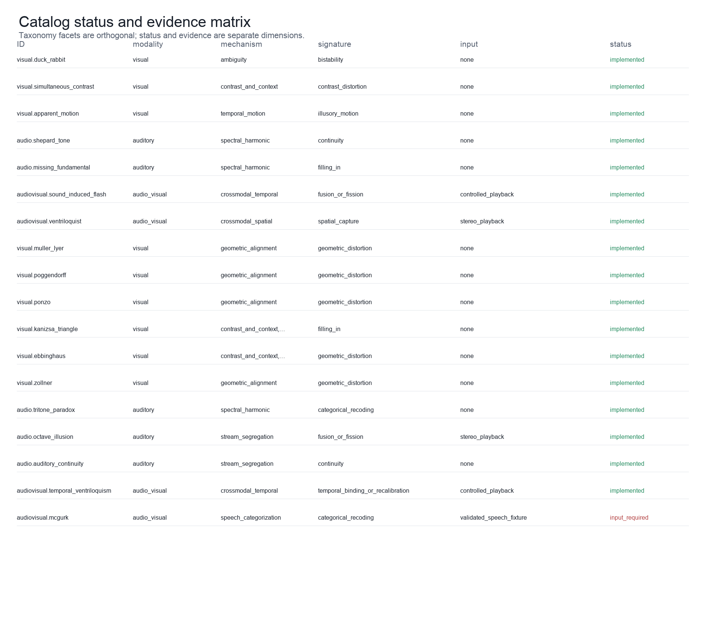{#fig:catalog_matrix}

What this figure shows: A matrix lists all catalog entries with modality, mechanism, signature, input requirement, and implementation status. The live catalog matrix contains 18 entries and keeps modality, mechanism, perceptual signature, input requirement, evidence status, and implementation status as separate facets. Source data output/data/catalog_matrix.json preserve the exact taxonomy snapshot and its source-reference namespace; status is not a proxy for perceptual validation. Controls: live taxonomy registry; evidence matrix snapshot; seed not applicable to the catalog diagram. Objective facts: 18 catalog rows; categorical facets and statuses; no observer-level quantity is applicable. Claim level: source_supported. Source data: output/data/catalog_matrix.json (SHA-256 digest recorded in the figure registry). Evidence lineage: gregory1997visual, hirst2020sound, bruns2019ventriloquist. Limitations: Taxonomy facets are engineering classifications and remain provisional where the literature supports competing accounts. Boundary: Catalog coverage is bounded to this registered package and does not enumerate all known illusions.

The complete catalog matrix [@fig:catalog_matrix] is tabulated in the standalone
Appendix A [@sec:appendix_catalog] and in [@tbl:catalog]. The corresponding
machine-readable evidence matrix records the source role, exact supported claim,
engineering departure, and limitation for every entry. Keeping the table in an
appendix gives the main results narrative room to explain the contract without
turning a mutable registry snapshot into a prose claim.

## Typed domains and delivery profiles

| Type | Unit | Validated domain | Role |
|---|---|---|---|
| PixelDimension | pixels | 8–4096 | image/video width and height |
| GrayscaleLevels | levels | 2–256 | representable grayscale levels |
| QuantizationLevels | levels | 2–256 | output quantization buckets |
| FrequencyHz | Hz | > 0 and finite | oscillator and harmonic frequencies |
| SampleRate | samples/s | 1,000–384,000 | audio sampling clock |
| FrameRate | frames/s | 1–240 | video presentation clock |
| SyncOffsetMs | ms | −10,000–10,000 | audio relative to video |
| SpatialOffset | normalized | −1–1 | declared crossmodal spatial discrepancy |

: Typed parameter domains and units. {#tbl:parameters}

The parameter contracts are summarized in [@tbl:parameters]. They constrain
physical construction and serialization; they are not psychophysical scales.

| Format | Backend | Artifact | Profile | Status |
|---|---|---|---|---|
| PNG | Pillow | image | lossless uint8 raster | available |
| WAV | python wave | audio | PCM 8/16/24/32-bit | available |
| GIF | Pillow | video | palette animation with declared duration | available |
| NPZ | NumPy | canonical artifact | exact little-endian float32 archive | available |
| MP4 | ffmpeg | video/audiovisual | H.264 or muxed MP4; decode inspected | available |

: Encoding profiles and backend capabilities. {#tbl:encodings}

The delivery profiles are summarized in [@tbl:encodings]. Backend availability
is environment-dependent and is recorded at generation time.

The catalog distinguishes a physical construction from an observer claim. For
example, the sound-induced-flash generator establishes one flash and one or two
beep events on a shared clock; it does not establish a reported flash count.
Similarly, the temporal-ventriloquism generator exposes a declared timing
offset, while the literature reports observer-dependent temporal judgments
under specific tasks and timing conditions [@vroomen2004temporal].

## Pipeline and provenance

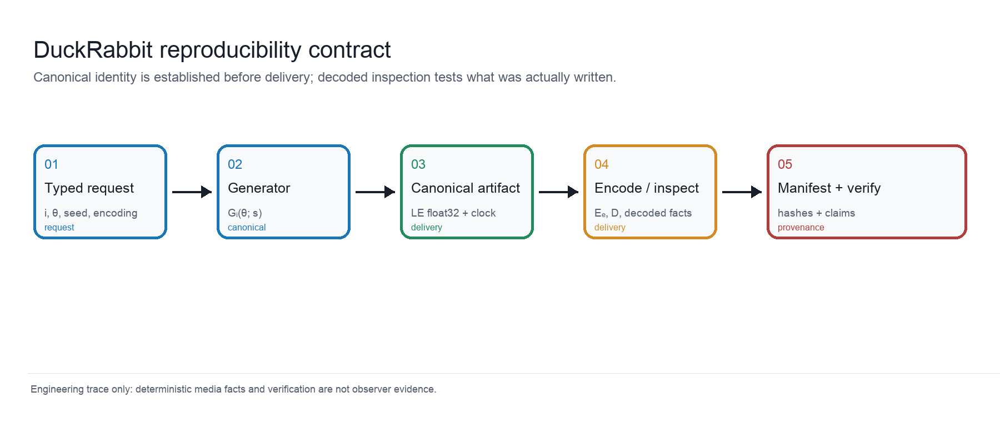{#fig:architecture}

What this figure shows: Five labeled stages connect a typed request to a deterministic canonical artifact, encoded media, decoded inspection, and a verification manifest. This schematic separates a typed request from the canonical artifact it generates, the optional delivery encoder, decoded inspection, and the manifest-level verification decision. Arrows indicate data and provenance dependencies rather than a causal model of perception; the seed is 0 and the complete stage record is in source data output/data/architecture.json. Controls: typed request q=(i,θ,s,e) with seed s=0; default generator and delivery-independent canonicalization. Objective facts: no unit-bearing objective quantity is applicable to this architecture diagram; stage identities and provenance fields are recorded in the sidecar. Claim level: canonical_stimulus. Source data: output/data/architecture.json (SHA-256 digest recorded in the figure registry). Evidence lineage: formalism:eq:typed_request, formalism:eq:canonical_generation, formalism:eq:encoding_verification. Limitations: The schematic abstracts implementation boundaries and does not represent an observer study or a causal theory of perception. Boundary: The pipeline verifies reproducible media facts, not what a person experiences.

The generated architecture figure [@fig:architecture] shows the separation between request,
canonical artifact, delivery adapter, decoded inspection, and manifest. The
canonical digest is the identity of the in-memory stimulus; an encoded hash is
the identity of the delivered file. The difference is intentional.

## Visual constructions and parameter sweeps

{#fig:visual_panel}

What this figure shows: A 9-panel gallery shows every currently implemented visual catalog entry, with stable IDs and physical raster summaries: Duck-rabbit ambiguous figure, Simultaneous contrast stimulus, Apparent-motion frame sequence, Müller-Lyer geometric illusion, Poggendorff geometric illusion, Ponzo perspective illusion, Kanizsa illusory-contour triangle, Ebbinghaus context-size illusion, Zöllner orientation illusion. This complete gallery presents one deterministic representative from each of the 9 currently implemented visual catalog entries: Duck-rabbit ambiguous figure, Simultaneous contrast stimulus, Apparent-motion frame sequence, Müller-Lyer geometric illusion, Poggendorff geometric illusion, Ponzo perspective illusion, Kanizsa illusory-contour triangle, Ebbinghaus context-size illusion, Zöllner orientation illusion. The panel therefore covers the package's available visual families—ambiguous figure, contrast, apparent motion, geometric context, illusory contour, contextual size, and orientation-related constructions—using typed defaults at seed 0. For the temporally expressed apparent-motion entry, the displayed tile is its first frame and the source data preserve the full sequence. The source data sidecar output/data/visual_panel.json records the stable ID, generator parameters, canonical SHA-256 digest, Rec. 709 or grayscale luminance statistics, raster-level counts, and parameter boundary for every tile. Controls: one default typed parameter object per implemented visual entry; seed s=0; dimensions, luminance bounds, grayscale, and quantization controls remain in each generator schema; temporal entries display their first frame but retain sequence metrics. Objective facts: per tile: mean and standard-deviation relative luminance, unique raster levels, and canonical SHA-256 digest; temporal entries additionally retain frame count, frame rate, and frame deltas; definitions and units are in the source data JSON. Claim level: canonical_stimulus. Source data: output/data/visual_panel.json (SHA-256 digest recorded in the figure registry). Evidence lineage: gregory1997visual, brugger1999duckrabbit, howe2005muller, morgan1999poggendorff, fisher1967ponzo, yildiz2022ponzo, kanizsa1976contours, mruczek2015ebbinghaus, earle1995zollner, wertheimer1912motion, sekuler1996wertheimer. Limitations: The gallery is complete for implemented visual entries in this package, not a complete survey of visual illusions; literature families, historical displays, and DuckRabbit rasters are not pixel-identical by default. Viewing scale, display calibration, viewing distance, and observer conditions can change the relevance of a construction; the gallery does not measure an observer's perceptual report. Boundary: The figure establishes coverage of the package's implemented visual constructions and their deterministic raster facts. It does not establish that any viewer will perceive the named signature, nor that the set is exhaustive of the visual-illusion literature.

The visual panel [@fig:visual_panel] is deliberately a coverage figure: it
contains one deterministic representative for every currently implemented
visual entry, including apparent motion and Zöllner in addition to the static
ambiguous-figure, contrast, geometric-context, illusory-contour, and contextual-
size families. Equalities, masks, line geometry, luminance bounds, and temporal
positions are properties of the typed rasters or sequences. They are not
observer scores, and the gallery is not an exhaustive ontology of visual
illusions.

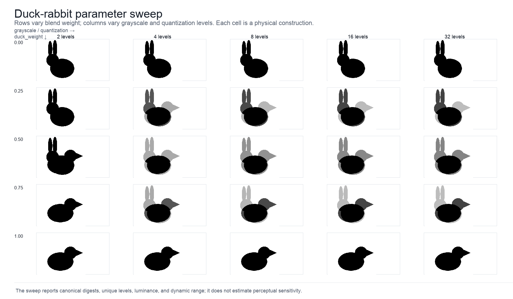{#fig:visual_sweep}

What this figure shows: A labeled grid crosses five duck–rabbit blend weights with five grayscale and quantization settings, with physical metrics recorded for each cell. This 5×5 sweep varies duck–rabbit blend weight across rows and jointly varies grayscale and quantization levels across columns. Each cell is regenerated from an immutable typed parameter object at seed 0; source data output/data/visual_sweep.json records canonical digests, unique-level counts, normalized luminance, and effective dynamic range for every condition. Controls: duck_weight ∈ {0,.25,.5,.75,1}; grayscale=quantization ∈ {2,4,8,16,32}; seed s=0. Objective facts: 25 canonical rasters; unique levels, normalized mean luminance, and effective dynamic range per cell. Claim level: physical_metric. Source data: output/data/visual_sweep.json (SHA-256 digest recorded in the figure registry). Evidence lineage: brugger1999duckrabbit, gregory1997visual. Limitations: The grid is a sensitivity of the construction parameters, not a psychophysical sensitivity curve or a validated observer effect. Boundary: The chosen grid is an engineering sampling of the parameter domain and does not imply an optimal or perceptually uniform spacing.

The sweep [@fig:visual_sweep] varies duck-weight from 0 to 1 and jointly varies representable
grayscale and quantization levels. The source data preserve canonical digests
and unique-value counts; no perceptual score is assigned to a sweep cell.

## Temporal and auditory constructions

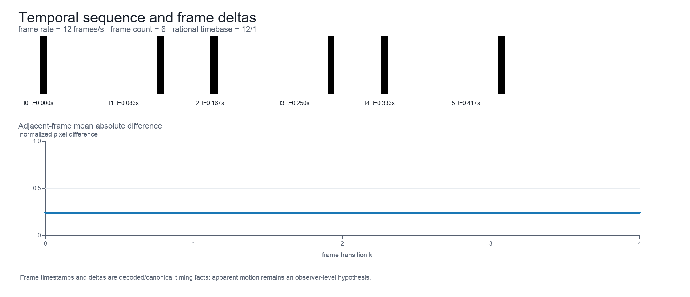{#fig:temporal_sequence}

What this figure shows: Six ordered frames are labeled with timestamps and paired with a line plot of adjacent-frame normalized pixel differences. The frame strip exposes the order and timestamps of the apparent-motion construction, while the lower trace reports adjacent-frame mean absolute pixel differences. Source data output/data/temporal_sequence.json preserve frame count, frame rate, reduced rational timebase, timestamps in seconds, and the nonzero transition series; seed 0 identifies the generated sequence. Controls: visual.apparent_motion default typed parameters; frame rate and frame count from the canonical sequence; seed s=0. Objective facts: timestamps in seconds, frame rate in frames/s, frame count, rational timebase, and adjacent-frame normalized pixel difference. Claim level: physical_metric. Source data: output/data/temporal_sequence.json (SHA-256 digest recorded in the figure registry). Evidence lineage: wertheimer1912motion, sekuler1996wertheimer. Limitations: Frame succession and frame deltas are physical file properties; playback timing, display persistence, and motion reports require a controlled observer task. Boundary: The figure documents temporal structure rather than the presence, direction, or strength of perceived motion.

The temporal figure [@fig:temporal_sequence] reports frame succession, rational frame rate, and
frame-to-frame mean absolute differences. These facts establish temporal
structure in the file, not the presence or strength of perceived motion.

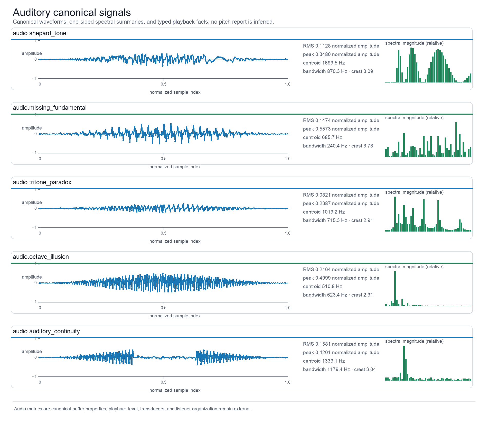{#fig:audio_signals}

What this figure shows: Five labeled rows show canonical audio waveforms, relative one-sided spectral bars, RMS and peak in normalized amplitude, and spectral summaries in hertz. Five implemented auditory constructions—Shepard tone, missing fundamental, tritone paradox, octave illusion, and auditory continuity—are shown as canonical waveforms with compact one-sided FFT summaries. Source data output/data/audio_signals.json records sample rate, channel layout, RMS, peak, spectral centroid, bandwidth, crest factor, canonical digest, and the declared display-bin convention; no pitch or stream report is inferred. Controls: default typed audio parameters; per-generator channel layout and sample rate; seed s=0; one-sided FFT display with 48 sampled bins. Objective facts: RMS and peak in normalized amplitude; spectral centroid and bandwidth in Hz; sample rate in samples/s; channel layout and canonical SHA-256 digest. Claim level: physical_metric. Source data: output/data/audio_signals.json (SHA-256 digest recorded in the figure registry). Evidence lineage: shepard1984scale, zatorre2005missing, deutsch1986tritone, repp1997tritone, deutsch1974octave, warren1970continuity, riecke2011continuity. Limitations: Playback level, transducer response, dichotic separation, masker design, and listener judgments are external to the canonical buffer. Boundary: The figure compares generated signal properties and literature-linked families; it does not establish pitch, continuity, or stream organization for a listener.

The auditory figure [@fig:audio_signals] shows canonical waveforms and spectral
summaries for Shepard, missing-fundamental, tritone, octave, and continuity
constructions. RMS, peak, spectral centroid, bandwidth, and channel layout are
calculated from the canonical buffer with explicit units and windowing rules.
Pitch direction, pitch height, continuity, and stream organization remain
observer-level outcomes that depend on playback and task conditions.

## Audiovisual timing and encoding

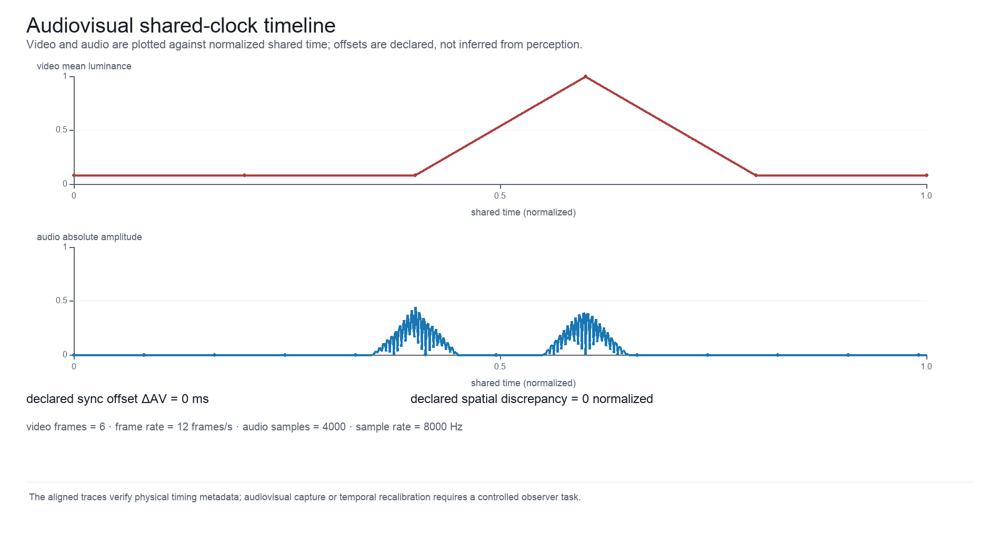{#fig:audiovisual_timeline}

What this figure shows: Two labeled traces share a normalized time axis: video mean luminance and audio absolute amplitude, with signed synchronization and spatial offsets printed below. Video mean luminance and rectified audio amplitude are placed on a common normalized time axis for the sound-induced-flash construction. Source data output/data/audiovisual_timeline.json records the video frame clock, audio sampling clock, event traces, signed audio-minus-video synchronization offset in milliseconds, and normalized spatial discrepancy; alignment is declared by the generator, not estimated from perception. Controls: audiovisual.sound_induced_flash default shared timeline; declared sync offset ΔAV and spatial offset; seed s=0. Objective facts: video luminance and audio envelope on normalized shared time; ΔAV in ms; spatial discrepancy in normalized units; frame and sample clocks in the sidecar. Claim level: physical_metric. Source data: output/data/audiovisual_timeline.json (SHA-256 digest recorded in the figure registry). Evidence lineage: shams2000sifi, hirst2020sound, vroomen2004temporal, hartcherobrien2011temporal. Limitations: Display refresh, audio hardware, event latency, and observer temporal binding are not measured by this figure. Boundary: A shared-clock construction is not evidence that observers bind the events at the declared or any other perceptual time.

The audiovisual timeline [@fig:audiovisual_timeline] displays video luminance and audio amplitude against
the shared clock, alongside declared synchronization and spatial offsets.
Ventriloquist stimuli require stereo playback and spatially resolved display;
temporal binding requires controlled timing and an observer task
[@bruns2019ventriloquist; @vroomen2004temporal].

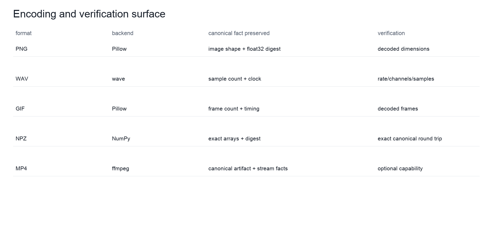{#fig:encoding_verification}

What this figure shows: A five-row comparison lists format, backend, preserved canonical facts, and the corresponding decoded verification checks. The comparison separates the canonical artifact from delivery containers: PNG, WAV, GIF, NPZ, and optional MP4/muxed MP4. Source data output/data/encoding_verification.json records backend identity, preserved canonical facts, decoded inspection targets, and capability status as observed in the generation environment; the table therefore describes an adapter contract rather than a claim about codec quality. Controls: typed encoding profile selected per artifact; overwrite and backend capability checks; seed inherited from the stimulus request. Objective facts: format availability and verification scope are environment observations; NPZ is exact while other formats are decoded and tolerance-checked. Claim level: encoded_media. Source data: output/data/encoding_verification.json (SHA-256 digest recorded in the figure registry). Evidence lineage: engineering:typed_media_adapters. Limitations: Backend availability, codec versions, container metadata, and lossy tolerances are environment-dependent; playback software can expose additional behavior. Boundary: A successful encode or decode does not validate an observer effect or guarantee cross-device perceptual equivalence.

The encoding matrix [@fig:encoding_verification] makes backend capability and verification scope visible.
NPZ is the exact canonical archive; PNG, WAV, GIF, and MP4 are delivery
containers whose decoded facts are checked against the manifest.

## Objective metric results {#sec:objective_metric_results}

| Metric | Unit | Definition | Tolerance | Claim level |
|---|---|---|---|---|
| mean_luminance | normalized_luminance | mean Rec. 709 relative luminance (grayscale is identity) | exact canonical | physical_metric |
| unique_values | levels | count of distinct canonical image values | exact integer | physical_metric |
| rms | normalized_amplitude | root-mean-square audio amplitude | finite scalar | physical_metric |
| peak | normalized_amplitude | maximum absolute audio amplitude | finite scalar | physical_metric |
| spectral_centroid_hz | Hz | energy-weighted one-sided spectral centroid | finite scalar | physical_metric |
| spectral_bandwidth_hz | Hz | spectral standard deviation around the one-sided centroid | finite scalar | physical_metric |
| crest_factor | ratio | audio peak divided by RMS with zero-RMS guard | finite scalar | physical_metric |
| mean_temporal_delta | normalized_pixel_difference | mean adjacent-frame absolute difference | finite scalar | physical_metric |
| sync_offset | ms | declared audio-minus-video offset | typed value | physical_metric |

: Objective metric definitions and epistemic boundary. {#tbl:metrics}

The metric definitions in [@tbl:metrics] are computed from canonical or
decoded artifacts and do not encode observer interpretations.

The default duck-rabbit artifact contains 3
unique raster levels and has mean normalized luminance 0.7770.
These values are live generated facts, not perceptual effect sizes.

## Observer estimands and verification controls

| Estimand | Response and model | Reference and contrast | Uncertainty |
|---|---|---|---|
| sifi flash count contrast | event count; poisson or ordinal | sifi one beep; two-beep minus one-beep event-count response | 95% confidence interval |
| temporal binding offset contrast | continuous magnitude; linear mixed | temporal sync; reported timing shift per declared sync offset | 95% confidence interval |

: Data-free observer outcomes and preregistered estimands. {#tbl:observer_estimands}

The analysis contract in [@tbl:observer_estimands] specifies estimands and
uncertainty procedures without asserting any result.

| Failure mode | Control | Expected result |
|---|---|---|
| altered encoded file | recompute encoded SHA-256 | fail |
| stale canonical digest | recompute canonical little-endian float32 digest | fail |
| incorrect decoded dimensions | compare inspection facts with manifest summary | fail |
| stream timing mismatch | compare duration/timebase and declared sync offset | fail |
| unsupported backend | capability probe before encoding | explicit capability error |
| conflicting format requests | reject format_name/output_spec disagreement | parameter error |

: Verification failure modes and negative controls. {#tbl:verification}

The negative controls in [@tbl:verification] test package integrity and media
contracts; they are not null findings about perception.

## Synthetic psychophysics model diagnostic

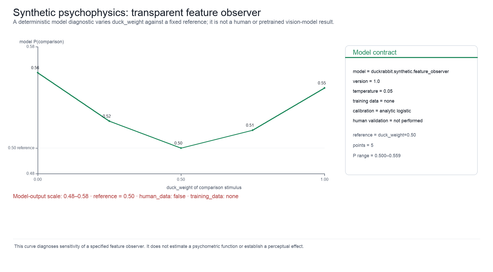{#fig:synthetic_psychophysics}

What this figure shows: A narrow-range line plot shows deterministic model probability across duck_weight values beside the model identity, temperature, no-training-data statement, and human-data boundary. The hand-specified feature observer compares duck_weight variants with a fixed canonical reference. Its probability trace is computed analytically from serialized features, weights, and temperature; source data output/data/synthetic_psychophysics.json records model ID/version, reference and comparison digests, seed, calibration, `training_data=none`, and `human_data=false`. The y-axis is deliberately a narrow model-output range rather than a human psychometric scale. Controls: duck_weight comparison against fixed reference; serialized feature weights and temperature; seed s=0. Objective facts: model probability and score delta on the displayed model-output scale; canonical stimulus digests; human_data=false; training_data=none. Claim level: synthetic_model_output. Source data: output/data/synthetic_psychophysics.json (SHA-256 digest recorded in the figure registry). Evidence lineage: observer:preregistered_estimands. Limitations: The model is hand-specified, has no training data, has not been calibrated against observers, and does not estimate a human threshold or effect size. Its probabilities are model outputs, not participant responses or a psychometric function. Boundary: This diagnostic tests deterministic orchestration and metamorphic input-output behavior only; empirical psychophysics remains future work.

The diagnostic [@fig:synthetic_psychophysics] evaluates a fully serialized,
hand-specified feature observer against a fixed canonical reference while
varying `duck_weight`. Its logistic probabilities are model outputs generated
from explicit features, weights, temperature, and seed; they are not a
pretrained vision-model score, a human psychometric function, an assumed human
effect size, or participant data. A future human study would require a
preregistered task, calibrated display and playback, consented participants,
exclusion and missingness rules, and an analysis contract before any observer
claim could be made.


---


# Experimental and Computational Setup {#sec:experimental_setup}

Core generation uses Python, NumPy, Pillow, and the standard library. The
default seed is 0 and generation is offline. The generators are analytic in
their typed parameters: the seed is recorded in manifests and study plans but
does not yet alter artifact bytes; seed-driven stimulus randomization awaits a
stochastic generator. PNG, GIF, WAV, and NPZ are
available without ffmpeg; MP4 and muxed audiovisual output require both
ffmpeg and ffprobe. Optional capabilities fail explicitly rather than silently
changing the requested artifact.

The deterministic validation suite executes real NumPy synthesis and real
temporary-file media round trips. It checks finite normalized arrays, typed
parameter boundaries, canonical hashes, dimensions, channel layouts, sample
rates, frame counts, timebases, duration agreement, synchronization offsets,
decoded stream facts, and registry/evidence consistency.

This is a software-validation protocol, not a psychophysical experiment. The
tests establish repeatability under the declared software and dependency
conditions; they do not establish replicability of an observer effect under a
new display, playback chain, population, or task. That distinction is why the
release reports both the exact environment contract and the missing observer
evidence.

The publication workflow writes 15 scientific PNG figures
plus a separately provenance-recorded editorial cover, machine-readable
source-data sidecars, a typed figure registry, 10 markdown
tables, and a publication report.
Each generated figure records its source function, seed, caption, alt text,
claim level, and SHA-256 digest. Generated files are disposable; the tracked
source is the generator and its tests.

The registry and cover report are independently revalidated after generation.
The registry validator rechecks code-owned captions, evidence namespaces,
source-data hashes, and figure hashes. The cover validator rechecks the
editorial source digest, portrait dimensions, variant set, and delivery hashes.
These checks prevent a successfully rendered image from becoming an
unexamined publication claim.

The observer harness is a data-free design layer. It creates reproducibly
randomized trial records, exports typed study plans, generates synthetic
responses for contract tests, and exposes model templates. It does not collect
or ship participant data. The publication atlas additionally runs
`duckrabbit.synthetic.feature_observer`, an explicitly hand-specified feature
model with no training corpus. Its canonical pairwise probabilities are
serialized as model output and are useful for end-to-end orchestration tests;
they are not a real vision-model estimate, a psychometric function, or an
observer result. Human sensitivity is deferred until a calibrated,
consented, preregistered study supplies response data and an analysis contract.


---


# Reproducibility and Provenance {#sec:reproducibility}

The reproducibility contract is:

1. construct the same frozen parameter dataclass;
2. use the same generator ID and the same deterministic seed;
3. compare the canonical artifact digest;
4. record the parameter schema, typed parameters, taxonomy, evidence boundary,
   canonical byte serialization, objective metrics, and encoding request;
5. if a file is written, inspect the decoded media and compare dimensions,
   channels, rates, frame counts, durations, timing offsets, and encoded hash;
6. retain the v2 manifest and source-data sidecars with the generated figure or
   table.
Note that in this release the generators are analytic in their typed
parameters: the request seed *s* is recorded in manifests and study plans and
excluded from the canonical digest, but it does not yet alter artifact bytes;
seed-driven stimulus randomization awaits a stochastic generator.

The contract is deliberately stronger than “the file can be downloaded.”
Research-software guidance treats versioned code, executable procedures,
dependencies, and retained inputs as part of the reproducible object
[@sandve2013simple; @wilson2014bestpractices]. FAIR guidance further asks that
digital research objects be findable, accessible, interoperable, and reusable,
while noting that software has lifecycle and maintenance constraints that are
not identical to those of static data [@wilkinson2016fair;
@lamprecht2020fairsoftware]. DuckRabbit operationalizes those principles with
typed metadata, deterministic hashes, source-data sidecars, explicit licenses,
and release gates rather than by implying that a generated media file is a
complete scientific replication.

The package reports implemented, planned, input_required as its catalog status vocabulary and
currently covers audio-visual, auditory, visual. The evidence layer contains 18
entry records backed by 36 source records, covering
18/18 catalog entries. The publication
workflow produces 15 figures and 10
tables from the live registry.

The public software record is
[the DuckRabbit public GitHub repository](https://github.com/docxology/DuckRabbit),
with Daniel Ari Friedman of the Active Inference Institute as author. The
release is archived on Zenodo at
[10.5281/zenodo.21419693](https://doi.org/10.5281/zenodo.21419693) (concept
DOI, always resolves to the latest version), with
[10.5281/zenodo.21419694](https://doi.org/10.5281/zenodo.21419694) identifying
this v0.5.0 release specifically.

The canonical buffer is the primary identity of a stimulus. Encoded files are
delivery artifacts with format-specific tolerances. The observer protocol is a
separate evidence layer: a manifest can prove what was presented without
proving what an observer experienced.

Synthetic psychophysics is a third, deliberately bounded object: the model is
a hand-specified deterministic feature observer; no training data; human_data=false, registered as `duckrabbit.synthetic.feature_observer`.
The model version, feature schema, weights, temperature, seed, calibration
statement, canonical reference/comparison digests, and `human_data=false` flag
are retained in `output/data/synthetic_psychophysics.json`. Re-running this
diagnostic checks deterministic model orchestration and stimulus-feature
sensitivity; it does not estimate a human observer or replace empirical
psychophysics.

The v2 verifier is a relational check rather than a field-presence check. It
rejects summaries whose dimensions, dtype, byte count, rates, duration, signal
range, frame deltas, or signed audiovisual offset disagree. Public manifest and
inspection mappings are recursively frozen after validation, and rational frame
rates are reduced before entering the clock contract. The read-only capability
probe records whether Pillow, NumPy, ffmpeg, or ffprobe are available in the
current environment; unavailable delivery paths remain explicit rather than
being silently downgraded.

The minimal regeneration commands are:

```bash
uv run pytest -q --cov=src/duckrabbit --cov-fail-under=90
uv run python scripts/generate_publication_outputs.py
uv run python scripts/generate_manuscript_variables.py
```

## Data availability and software citation

No participant records, fitted observer coefficients, or human psychophysics
are bundled. The synthetic diagnostic is explicitly model output with
`human_data=false` and `training_data=none`. Reuse should cite Daniel Ari
Friedman and the release metadata in `CITATION.cff`, together with the
source-specific scholarship in `references.bib`. Software-citation principles
recommend citing the software object itself, with enough version and identity
information to distinguish one release from another [@smith2016software]. The
DOI field carries the real, minted concept DOI
(`10.5281/zenodo.21419693`) and `doi_status` is `published`; no resolver URL
was manufactured before that identifier existed.


---


# Scope, Related Work, and Limitations {#sec:scope}

## Scope and epistemic boundary

DuckRabbit is a typed, reproducible stimulus-construction platform. Its unit of
work is an immutable request that yields a canonical image, audio buffer, video
sequence, or audiovisual timeline, together with objective measurements and
provenance. It is not an exhaustive ontology of all illusions, a perceptual
theory, a participant database, or a substitute for a controlled psychophysics
experiment. The live registry is therefore a deliberately bounded catalog: it
enumerates the families for which this release has both a generator contract
and a stated evidence boundary. Appendix A gives the complete current matrix;
the absence of a family from that matrix is not a claim that the family is
unimportant or unsupported in the wider literature.

The central distinction is between a construction and an observation. A
DuckRabbit generator can establish the dimensions, pixel values, sample values,
frequency components, frame clock, declared synchronization offset, encoded
hash, and decoded media facts of its output. It cannot, from those facts alone,
establish what a person sees, hears, counts, localizes, groups, or reports.
Every figure caption, evidence record, and claim-ledger entry preserves this
boundary. In particular, a literature citation establishes a source-supported
statement about a stimulus family or result under that source's conditions; it
does not certify pixel- or task-identical replication by a DuckRabbit artifact.

The historical foundation is intentionally worldwide and layered. The package
does not present a single invention narrative: it places ancient Greek,
medieval Arabic, classical Chinese, and early-modern European sources beside
nineteenth-century psychophysics and modern experimental work. This is a
scholarly orientation for separating physical construction, interpretation, and
observer evidence; it is not a claim that the current source set exhausts the
visual, auditory, or perceptual traditions of any region.

## Visual families

The modern label “visual illusion” sits on a longer experimental history than
the package's contemporary review sources alone suggest. Oppel's mid-century
catalogue of geometrical-optical illusions is now accessible with translation
and commentary [@wade2017oppel], and the primary nineteenth-century records
include Zöllner's account of crossing-line distortions and Müller-Lyer's report
of the arrow-wing configuration [@zoellner1860pseudoscopy;
@mullerlyer1889optical]. These sources are treated as historical anchors, not
as evidence that a present-day raster is identical to an original plate or
that its observer effect is invariant across conditions.

Gregory's classification is useful as a historical and conceptual orientation,
but it is not a universally agreed ontology. DuckRabbit consequently stores
visual modality, mechanism, perceptual signature, stimulus requirements, and
evidence status as separate facets rather than treating a single label as an
explanation [@gregory1997visual]. The visual atlas covers the implemented
families currently registered in the package: ambiguous figure, contrast,
apparent motion, Müller-Lyer, Poggendorff, Ponzo, Kanizsa-type subjective
contour, Ebbinghaus contextual size, and Zöllner/Judd orientation-related
geometry. “Coverage” here means one deterministic representative per live
entry, not a claim that one raster captures the historical stimulus space.

The duck/rabbit construction is an explicit example of why that distinction
matters. Brugger's historical analysis discusses variation among figure
variants and observers; DuckRabbit therefore exposes a blend parameter and
labels its output as a construction rather than promising a fixed alternation
rate or universal bistability [@brugger1999duckrabbit]. The Müller-Lyer entry
uses typed arrow geometry. Its engineering form is compatible with a family
whose image statistics have been analyzed as potentially informative about
image-source relationships, but the implementation does not adjudicate that
account or infer a perceived-length report [@mullerlyer1889optical;
@howe2005muller].

The Poggendorff generator makes the occluding geometry and virtual-line
orientation explicit. This is appropriate to a literature in which orientation
estimation and filtering accounts are theoretically relevant, while avoiding
the stronger claim that a particular raster reproduces a published bias
without the same observers, viewing conditions, and response task
[@morgan1999poggendorff]. The Ponzo construction is similarly bounded: the
converging context and test bars are deterministic, whereas the literature
contains multiple explanations of Ponzo-like effects rather than one settled
mechanism [@fisher1967ponzo; @yildiz2022ponzo].

Kanizsa-style subjective contours are represented as an illusory-contour
construction with explicit inducer geometry. The historical account motivates
the family label, while modern reviews place contour completion within a wider
literature on grouping, figure-ground organization, attention, and neural
mechanisms [@kanizsa1976contours; @wagemans2012gestalt]. Neither source licenses
a claim that the generated mask produces a uniform contour percept across
observers. The Ebbinghaus entry controls target and surround geometry; classic
work demonstrates that judged size depends on context, contour, and comparison
conditions, while later work shows that motion and other parameters can alter
the effect [@weintraub1979ebbinghaus; @mruczek2015ebbinghaus]. DuckRabbit's
static default is therefore an engineering baseline rather than a task-identical
replication. Zöllner/Judd geometry is likewise retained as a source-linked line
arrangement. Zöllner's 1860 report supplies the historical primary anchor,
while later work supplies a modern analysis of spatial filtering
[@zoellner1860pseudoscopy; @earle1995zollner]. Its typed line lengths and
orientations make the spatial stimulus auditable, while orientation judgments
remain outside the package contract.

Finally, apparent motion is included in the visual coverage panel because its
defining engineering object is temporal succession, not merely a static
pattern. The package verifies frame order, frame rate, timestamps, and
frame-to-frame differences. Wertheimer's foundational work and Sekuler's later
analysis motivate the family distinction; neither source turns a generated
frame strip into a universal report of motion [@wertheimer1912motion;
@sekuler1996wertheimer].

## Auditory families

The auditory catalog separates harmonic construction, spectral completion,
pitch-class context, dichotic channel assignment, and continuity/masking. A
Shepard-like signal is represented through additive partials and explicit
envelopes, following a historical literature of tone psychology and later work
on assimilation to an internalized musical scale [@stumpf1883tonpsychology;
@shepard1984scale]. The canonical buffer exposes
sample rate, amplitude bounds, channel count, partial frequencies, and envelope
parameters. It does not determine a listener's perceived pitch height or
direction.

The missing-fundamental construction removes a low component while retaining
harmonically related partials. This makes the spectral condition reproducible;
the associated pitch interpretation remains a listener-level question
[@zatorre2005missing]. Tritone and octave entries preserve channel structure,
phase, frequency relationships, and timing in typed parameters. Deutsch's
foundational accounts and Repp's analysis of spectral-envelope and context
effects motivate the evidence records, while also making listener and context
dependence central limitations [@deutsch1986tritone; @repp1997tritone;
@deutsch1974octave].

Auditory continuity is represented as an interrupted target with a typed masker
and gap. Warren's classic perceptual-restoration result and Riecke and
colleagues' separation of sensory and decisional contributions justify the
family's inclusion, but a generated masker is not evidence that a listener
will report an uninterrupted sound [@warren1970continuity;
@riecke2011continuity]. The audio atlas therefore reports RMS, peak, spectral
centroid, bandwidth, channel layout, and exact sample-level provenance—not
continuity, pitch, or stream judgments.

## Audiovisual and temporal binding families

Audiovisual constructions require a shared clock and an explicit sign
convention for offsets. The sound-induced-flash entry creates a typed visual
event and one or more audio events; the evidence record links it to the primary
demonstration and to a review of the broader literature [@shams2000sifi;
@hirst2020sound]. The package can verify event timestamps, sample/frame clocks,
and declared offsets. It does not infer a reported flash count, and it does not
assume that the same temporal window applies across displays, headphones,
latencies, or observers.

The spatial ventriloquist construction treats spatial discrepancy as a
parameter and records the channel and display requirements. Reviews describe
the ventriloquist illusion as a tool for studying multisensory processing, but
the review's scope is not a license to claim spatial capture from a file alone
[@bruns2019ventriloquist]. More general audiovisual accounts describe
integration and segregation as a causal-inference problem shaped by temporal
regularities and signal reliability [@noppeney2018causal]. That framework
clarifies why a declared offset is an experimental input, not an observer-level
outcome. Temporal ventriloquism receives a separate
temporal-binding signature rather than being collapsed into spatial capture.
Vroomen and de Gelder manipulated sound–flash timing in a flash-lag task and
reported timing-dependent changes under those experimental conditions;
Hartcher-O'Brien and Alais studied temporal ventriloquism in a purely temporal
context [@vroomen2004temporal; @hartcherobrien2011temporal]. DuckRabbit
implements the stimulus-side timing contract and leaves the observer-side
temporal-recalibration estimate to a future study.

McGurk remains `input_required`. The classic speech study motivates the family,
but a lawful and reproducible implementation requires checksummed speech and
video fixtures, licensing or consent records, a precise preprocessing contract,
and an ethical validation protocol [@mcgurk1976speech]. Cataloguing the gap is
more informative than silently substituting an unrelated synthetic voice or
claiming that a generic audiovisual mismatch is a McGurk replication.

## From literature to engineering contract

For each entry, the evidence matrix records a source role, exact
source-supported claim, engineering basis, limitation, and audit status. The
roles distinguish primary demonstration, review or synthesis, theoretical
account, engineering basis, limitation, and input gap. This prevents three
common category errors: treating a theory as settled mechanism, treating a
review as validation of new code, and treating a generator's deterministic
output as a participant result.

The package's literature fidelity is therefore best described as
“family-linked, parameterized engineering construction.” Some defaults are
historically motivated; none should be read as a claim of pixel identity unless
that identity is separately established. The checked-in scholarship snapshot
provides offline structural validation, including citation-key and DOI/URL
format checks. The explicit network audit adds resolver observations and
metadata matching; reachability alone is not treated as bibliographic
verification. This is a reproducible evidence boundary, not a claim that every
source is equally accessible or that theoretical disputes have been resolved.

## Limitations and future observer work

The package does not claim clinical validity, universal effect sizes,
cross-cultural invariance, perceptual equivalence across displays or
headphones, or observer-level truth from objective media metrics. Playback
level, gamma and display calibration, viewing distance, refresh rate, stereo
separation, room acoustics, audio transducer response, attention, expectation,
language, expertise, and task can all matter. Codec behavior and device
latency can introduce additional differences even when decoded media facts
match within the declared tolerance.

The synthetic observer diagnostic is intentionally not a substitute for a real
vision model or human data. It is a serialized, hand-specified feature
function with `training_data=none`, `calibration = analytic`, and
`human_data=false`; its metamorphic and sensitivity checks test orchestration,
not visual consciousness or human discrimination. A future observer study must
pre-register the response scale, reference condition, estimand, exclusions,
missing-data rule, randomization seed, display and playback controls, and
uncertainty procedure. It must also report the participant and item sampling
frame rather than importing a model-output probability as an assumed effect
size. The observer harness is consequently study-ready scaffolding, not a
result set.

No participant data are bundled with DuckRabbit. The data-availability boundary
is intentional: canonical artifacts, encoded fixtures where lawful, source-data
sidecars, and deterministic synthetic diagnostics are software outputs;
observer outcomes require separately governed data collection. The package is
authored by Daniel Ari Friedman and is archived under DOI
`10.5281/zenodo.21419693`; release metadata and software-citation guidance are
generated from the same identity contract as the manuscript.


---


# Publication Atlas, Caption Contract, and Scholarship Audit {#sec:publication_audit}

The publication layer is generated from the same typed package state as the
stimuli. It contains 15 scientific figures, 10
machine-readable tables, and a separately provenance-recorded editorial cover.
The cover is an illustration of the project's subject and methods aesthetic; it
is not a stimulus, a participant result, or evidence of a perceptual effect.

## Claim-level visualization

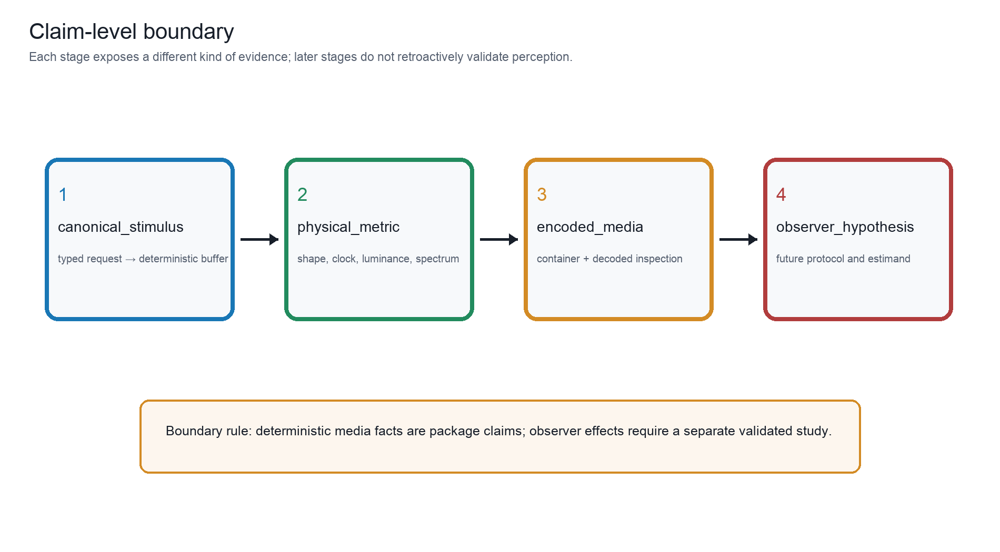{#fig:claim_boundary}

What this figure shows: Four numbered boxes separate canonical stimulus, physical metric, encoded media, and observer hypothesis, with a boundary rule stating that observer effects require a separate study. The four-stage boundary distinguishes what DuckRabbit can establish directly—canonical stimulus identity, physical/media metrics, and decoded encoded-media facts—from a future observer hypothesis. Source data output/data/claim_boundary.json records the stage definitions and boundary rule; the arrows describe increasing evidential requirements, not an inference that one stage establishes the next. Controls: claim levels in the taxonomy and manifest; seed not applicable to the explanatory diagram. Objective facts: no unit-bearing objective quantity is applicable; stage definitions and evidence boundaries are preserved in the sidecar. Claim level: source_supported. Source data: output/data/claim_boundary.json (SHA-256 digest recorded in the figure registry). Evidence lineage: formalism:eq:observer_estimand, formalism:eq:canonical_digest. Limitations: The diagram is a documentation contract and does not replace a preregistered observer study or empirical data. Boundary: A deterministic artifact can support a future hypothesis but cannot supply the observer data required to test it.

The claim boundary in [@fig:claim_boundary] is a typed epistemic interface. A
canonical digest identifies a deterministic buffer; objective metrics identify
properties of that buffer; encoded-media verification identifies facts of the
delivered file. A future observer hypothesis is a different object with its
own protocol, estimand, and uncertainty interval.

## Scholarship map and lineage

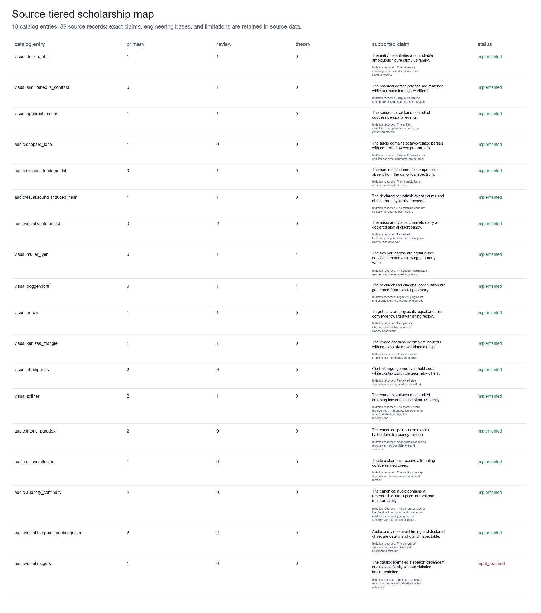{#fig:scholarship_map}

What this figure shows: Rows map catalog entries to source tiers, exact supported claims, engineering bases, limitations, and implementation status. The map links every catalog entry to its primary, review, and theory records, then preserves the exact source-supported claim, engineering departure, limitation, and implementation status. Source data output/data/scholarship_map.json are generated from the checked-in evidence matrix; a source record supports only the statement written in that record and does not certify pixel- or task-identical replication. Controls: checked-in evidence matrix; source roles and entry statuses; audit date recorded in data/evidence_matrix.json. Objective facts: one evidence row per catalog entry (18 entries); source-tier counts, exact claim text, engineering basis, limitation, and gap status. Claim level: source_supported. Source data: output/data/scholarship_map.json (SHA-256 digest recorded in the figure registry). Evidence lineage: gregory1997visual, brugger1999duckrabbit, yildiz2022ponzo, hirst2020sound, bruns2019ventriloquist. Limitations: The offline snapshot validates citation and lineage structure; live resolver status is a separate audit, and classifications can remain contested. Boundary: Scholarship coverage bounds the package’s evidence record and does not establish that any generated stimulus produces a universal percept.

The source map [@fig:scholarship_map] and [@tbl:evidence_audit] make five
distinctions explicit: a primary demonstration, a review, a theoretical
account, DuckRabbit's engineering basis, and an evidence limitation. Brugger's
duck/rabbit study documents variation across figure variants and observers;
this supports a careful ambiguity-family record, not a universal bistability
claim [@brugger1999duckrabbit]. Yildiz et al. review competing explanations of
Ponzo-like illusions, so the catalog retains both a geometric construction and
an unresolved theoretical boundary [@yildiz2022ponzo]. Repp's tritone analysis
likewise motivates listener- and context-sensitive limitations
[@repp1997tritone].

The audit also treats software and its metadata as part of the scholarly
record. FAIR guidance emphasizes machine-actionable provenance and reuse, and
software-citation principles emphasize crediting an identifiable version rather
than citing an undifferentiated project name [@wilkinson2016fair;
@smith2016software]. Accordingly, the release includes `CITATION.cff`,
CodeMeta, Zenodo metadata, versioned manifests, source-data sidecars, and
resolver-linked bibliography entries. These improve discoverability and
attribution; they do not increase the evidential level of any perceptual claim.

The public software identity is explicit: DuckRabbit is published and citable
at the [DuckRabbit public GitHub repository](https://github.com/docxology/DuckRabbit)
under the authorship of Daniel Ari Friedman, Active Inference Institute. The
generated bundle in this repository remains the authoritative release candidate
until the external template handoff is completed.

## Formal traceability and objective metrics

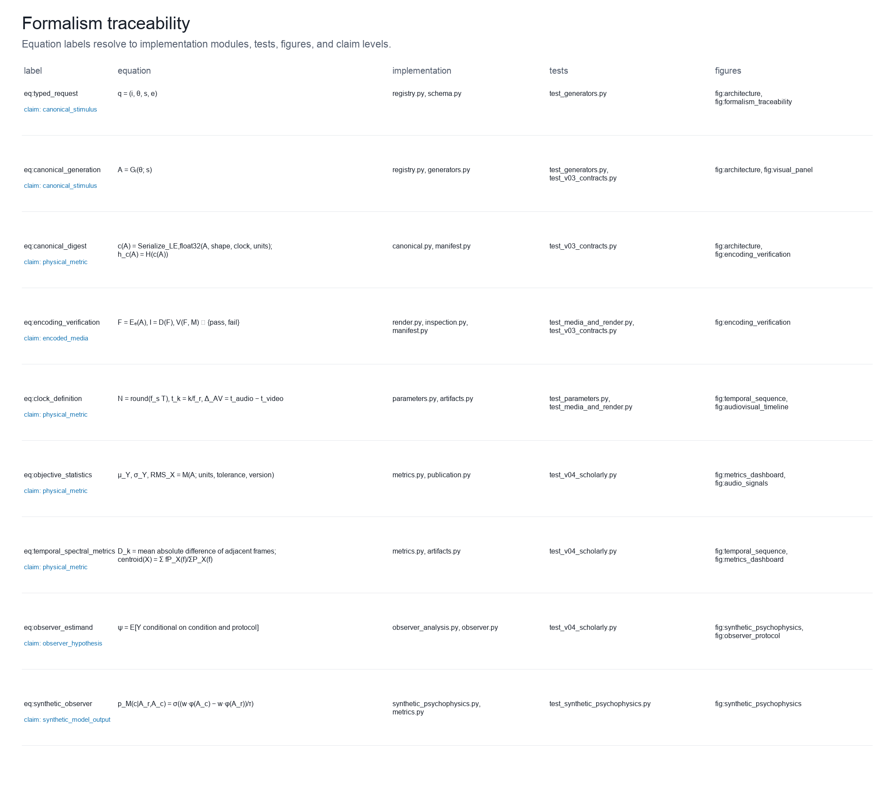{#fig:formalism_traceability}

What this figure shows: Rows connect equation labels to their mathematical definition, implementation paths, tests, figure labels, and claim levels. The traceability registry connects the nine numbered equations to symbols, implementation modules, tests, and registered figures. Source data output/data/formalism_traceability.json is the machine-readable crosswalk used by the manuscript; it demonstrates contract coverage and test linkage without converting formal notation into empirical evidence. Controls: formalism registry version; seed not applicable to the traceability diagram. Objective facts: nine equation records with implementation, test, figure, and claim-level fields; no unit-bearing measurement is plotted. Claim level: physical_metric. Source data: output/data/formalism_traceability.json (SHA-256 digest recorded in the figure registry). Evidence lineage: formalism:eq:canonical_digest, formalism:eq:clock_definition, formalism:eq:objective_statistics. Limitations: Traceability records documentation and verification scope; it does not establish the truth of an observer-level theory. Boundary: A linked equation and test can show an implemented contract, not a validated perceptual law.

The formalism registry [@fig:formalism_traceability] links equations
[@eq:typed_request; @eq:canonical_generation; @eq:canonical_digest; @eq:encoding_verification; @eq:clock_definition; @eq:objective_statistics; @eq:temporal_spectral_metrics; @eq:observer_estimand; @eq:synthetic_observer]
to implementation modules, tests, and figures. The contract is intentionally
auditable: equation labels point to code-owned records, while empirical claims
remain outside the generator's authority.

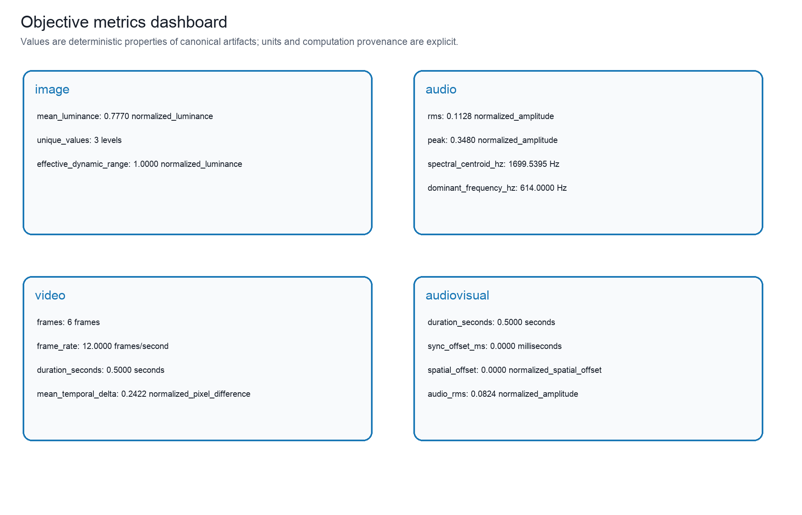{#fig:metrics_dashboard}

What this figure shows: Four artifact cards list image, audio, video, and audiovisual metrics with units, computation provenance, and claim level. The dashboard presents representative measurements from image, audio, video, and audiovisual canonical artifacts. Source data output/data/metrics_dashboard.json retains metric name, value, unit, computation version, tolerance, claim level, and canonical digest; luminance is normalized, amplitude is normalized, spectra are in hertz, frame differences are normalized pixel differences, and synchronization is in milliseconds. Controls: default canonical artifacts; metric computation version and tolerance recorded in the source-data sidecar; seed s=0. Objective facts: finite objective values with units: normalized luminance/amplitude, Hz, normalized pixel difference, ms, counts, and durations. Claim level: physical_metric. Source data: output/data/metrics_dashboard.json (SHA-256 digest recorded in the figure registry). Evidence lineage: formalism:eq:objective_statistics, formalism:eq:temporal_spectral_metrics. Limitations: Metrics are media properties and do not encode pitch, size, motion, localization, binding, or other observer interpretations. Boundary: Metric reproducibility is a package property; interpretation as perception requires a separate observer design and data.

The metrics dashboard [@fig:metrics_dashboard] reports units, computation
version, and canonical digests. Luminance statistics are normalized raster
properties; RMS and peak are normalized-amplitude properties; spectral values
are in Hz; frame deltas are normalized pixel differences; and synchronization
offsets are in milliseconds. None is a psychophysical score.

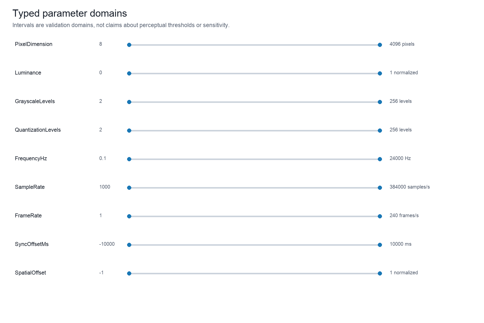{#fig:parameter_domains}

What this figure shows: Horizontal interval markers show typed domains for dimensions, luminance, levels, frequency, sampling, frame rate, synchronization, and spatial discrepancy. The domain map shows the validated ranges for dimensions, luminance, grayscale and quantization levels, frequency, sampling rate, frame rate, synchronization offset, and spatial discrepancy. Source data output/data/parameter_domains.json records the type name, unit, interval, and engineering role; intervals prevent malformed media and are not proposed as sensitivity thresholds. Controls: parameter schema version and validated scalar domains; seed not applicable to the domain diagram. Objective facts: dimensionless, pixel, level, Hz, samples/s, frames/s, ms, and normalized spatial units as listed per parameter. Claim level: canonical_stimulus. Source data: output/data/parameter_domains.json (SHA-256 digest recorded in the figure registry). Evidence lineage: formalism:eq:typed_request. Limitations: The intervals are software validation bounds and do not encode safe listening levels, display limits, or psychophysical thresholds. Boundary: A valid parameter is a reproducible construction request, not evidence that the requested value is perceptually effective.

The domain map [@fig:parameter_domains] is a validation visualization. Bounds
are chosen to prevent malformed media and unsafe encodings, not to predict a
viewer, listener, or participant's sensitivity.

## Observer-design boundary

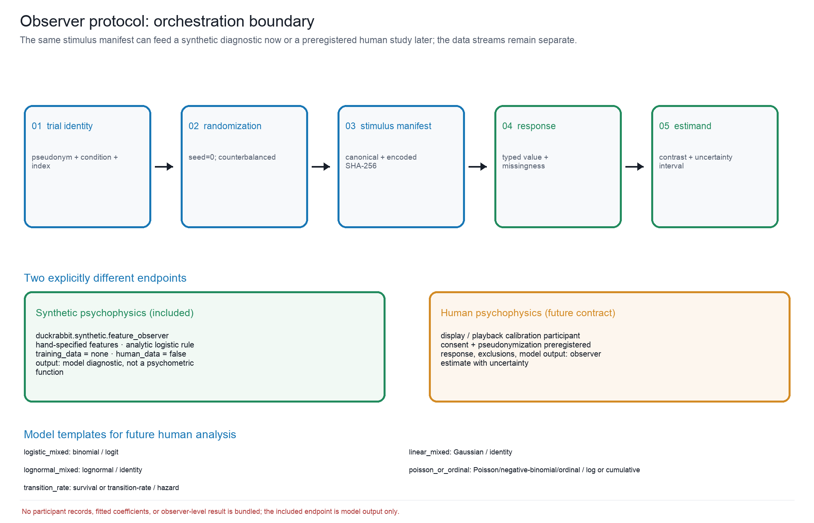{#fig:observer_protocol}

What this figure shows: A flow diagram connects trial identity, randomization, stimulus manifest, response, aggregate estimand, and analysis-model templates, with a synthetic-only boundary. The study-ready scaffold moves from pseudonymous trial identity and deterministic randomization to a stimulus manifest and encoded-file hash, typed response or missingness, and a preregistered estimand. Source data output/data/observer_protocol.json records the study design, randomization seed, model templates, and synthetic-only status; no participant record is included. Controls: study design and deterministic randomization seed recorded in the sidecar; synthetic response generation is separate from human data. Objective facts: trial counts, condition structure, estimand templates, response schemas, and model families; participant outcomes are not applicable. Claim level: observer_hypothesis. Source data: output/data/observer_protocol.json (SHA-256 digest recorded in the figure registry). Evidence lineage: observer:preregistered_estimands. Limitations: The scaffold specifies future data collection and analysis but supplies no participant responses, fitted coefficients, power claim, or validated observer effect. Boundary: The protocol is ready for ethical and preregistered extension, not evidence that the proposed effect exists.

The observer scaffold [@fig:observer_protocol] starts with a pseudonymous trial
identity and deterministic randomization, binds the stimulus manifest and
encoded hash, records a typed response or missingness state, and ends at a
preregistered estimand. The companion diagnostic
[@fig:synthetic_psychophysics] is a deterministic, hand-specified feature
observer with `training_data=none` and `human_data=false`; it is not a
pretrained vision model, psychometric function, or participant result. Human
psychophysics remains a future evidence layer requiring calibrated playback,
consent, preregistration, and observed responses.

## Generated audit tables

| Figure / claim level | Source and evidence | Controls and objective facts | Limitations, boundary, and accessibility |
|---|---|---|---|
| fig:architecture; canonical stimulus | output/data/architecture.json; formalism:eq:typed request, formalism:eq:canonical generation, formalism:eq:encoding verification | Controls: typed request q=(i,θ,s,e) with seed s=0; default generator and delivery-independent canonicalization Objective: no unit-bearing objective quantity is applicable to this architecture diagram; stage identities and provenance fields are recorded in the sidecar | Limitations: The schematic abstracts implementation boundaries and does not represent an observer study or a causal theory of perception. Boundary: The pipeline verifies reproducible media facts, not what a person experiences. Accessibility: Stage names, mathematical symbols, and arrow direction are printed directly; color is redundant. |
| fig:catalog matrix; source supported | output/data/catalog matrix.json; gregory1997visual, hirst2020sound, bruns2019ventriloquist | Controls: live taxonomy registry; evidence matrix snapshot; seed not applicable to the catalog diagram Objective: 18 catalog rows; categorical facets and statuses; no observer-level quantity is applicable | Limitations: Taxonomy facets are engineering classifications and remain provisional where the literature supports competing accounts. Boundary: Catalog coverage is bounded to this registered package and does not enumerate all known illusions. Accessibility: Every status and facet is written as text; color only reinforces the printed status. |
| fig:visual panel; canonical stimulus | output/data/visual panel.json; gregory1997visual, brugger1999duckrabbit, howe2005muller, morgan1999poggendorff, fisher1967ponzo, yildiz2022ponzo, kanizsa1976contours, mruczek2015ebbinghaus, earle1995zollner, wertheimer1912motion, sekuler1996wertheimer | Controls: one default typed parameter object per implemented visual entry; seed s=0; dimensions, luminance bounds, grayscale, and quantization controls remain in each generator schema; temporal entries display their first frame but retain sequence metrics Objective: per tile: mean and standard-deviation relative luminance, unique raster levels, and canonical SHA-256 digest; temporal entries additionally retain frame count, frame rate, and frame deltas; definitions and units are in the source data JSON | Limitations: The gallery is complete for implemented visual entries in this package, not a complete survey of visual illusions; literature families, historical displays, and DuckRabbit rasters are not pixel-identical by default. Viewing scale, display calibration, viewing distance, and observer conditions can change the relevance of a construction; the gallery does not measure an observer's perceptual report. Boundary: The figure establishes coverage of the package's implemented visual constructions and their deterministic raster facts. It does not establish that any viewer will perceive the named signature, nor that the set is exhaustive of the visual-illusion literature. Accessibility: Each tile is labeled by stable illusion ID and accompanied by printed luminance, level-count, and digest fields; color only reinforces grouping and is not required to identify a stimulus. |
| fig:visual sweep; physical metric | output/data/visual sweep.json; brugger1999duckrabbit, gregory1997visual | Controls: duck weight ∈ {0,.25,.5,.75,1}; grayscale=quantization ∈ {2,4,8,16,32}; seed s=0 Objective: 25 canonical rasters; unique levels, normalized mean luminance, and effective dynamic range per cell | Limitations: The grid is a sensitivity of the construction parameters, not a psychophysical sensitivity curve or a validated observer effect. Boundary: The chosen grid is an engineering sampling of the parameter domain and does not imply an optimal or perceptually uniform spacing. Accessibility: Row and column labels state the parameter values; numerical metrics and units are available in the sidecar. |
| fig:temporal sequence; physical metric | output/data/temporal sequence.json; wertheimer1912motion, sekuler1996wertheimer | Controls: visual.apparent motion default typed parameters; frame rate and frame count from the canonical sequence; seed s=0 Objective: timestamps in seconds, frame rate in frames/s, frame count, rational timebase, and adjacent-frame normalized pixel difference | Limitations: Frame succession and frame deltas are physical file properties; playback timing, display persistence, and motion reports require a controlled observer task. Boundary: The figure documents temporal structure rather than the presence, direction, or strength of perceived motion. Accessibility: Frame index, seconds, frames per second, and normalized-difference labels remain interpretable without color. |
| fig:audio signals; physical metric | output/data/audio signals.json; shepard1984scale, zatorre2005missing, deutsch1986tritone, repp1997tritone, deutsch1974octave, warren1970continuity, riecke2011continuity | Controls: default typed audio parameters; per-generator channel layout and sample rate; seed s=0; one-sided FFT display with 48 sampled bins Objective: RMS and peak in normalized amplitude; spectral centroid and bandwidth in Hz; sample rate in samples/s; channel layout and canonical SHA-256 digest | Limitations: Playback level, transducer response, dichotic separation, masker design, and listener judgments are external to the canonical buffer. Boundary: The figure compares generated signal properties and literature-linked families; it does not establish pitch, continuity, or stream organization for a listener. Accessibility: Waveform, spectral, amplitude, and frequency labels are printed; bar color is not the sole encoding. |
| fig:audiovisual timeline; physical metric | output/data/audiovisual timeline.json; shams2000sifi, hirst2020sound, vroomen2004temporal, hartcherobrien2011temporal | Controls: audiovisual.sound induced flash default shared timeline; declared sync offset ΔAV and spatial offset; seed s=0 Objective: video luminance and audio envelope on normalized shared time; ΔAV in ms; spatial discrepancy in normalized units; frame and sample clocks in the sidecar | Limitations: Display refresh, audio hardware, event latency, and observer temporal binding are not measured by this figure. Boundary: A shared-clock construction is not evidence that observers bind the events at the declared or any other perceptual time. Accessibility: The two channels, time axis, signed offset convention, and normalized spatial discrepancy are labeled in text. |
| fig:encoding verification; encoded media | output/data/encoding verification.json; engineering:typed media adapters | Controls: typed encoding profile selected per artifact; overwrite and backend capability checks; seed inherited from the stimulus request Objective: format availability and verification scope are environment observations; NPZ is exact while other formats are decoded and tolerance-checked | Limitations: Backend availability, codec versions, container metadata, and lossy tolerances are environment-dependent; playback software can expose additional behavior. Boundary: A successful encode or decode does not validate an observer effect or guarantee cross-device perceptual equivalence. Accessibility: Format, backend, preserved fact, and verification columns are textual and remain usable without color. |
| fig:synthetic psychophysics; synthetic model output | output/data/synthetic psychophysics.json; observer:preregistered estimands | Controls: duck weight comparison against fixed reference; serialized feature weights and temperature; seed s=0 Objective: model probability and score delta on the displayed model-output scale; canonical stimulus digests; human data=false; training data=none | Limitations: The model is hand-specified, has no training data, has not been calibrated against observers, and does not estimate a human threshold or effect size. Its probabilities are model outputs, not participant responses or a psychometric function. Boundary: This diagnostic tests deterministic orchestration and metamorphic input-output behavior only; empirical psychophysics remains future work. Accessibility: Model scale, reference line, model identity, and `human data=false` are printed; color is not needed to interpret the curve. |
| fig:claim boundary; source supported | output/data/claim boundary.json; formalism:eq:observer estimand, formalism:eq:canonical digest | Controls: claim levels in the taxonomy and manifest; seed not applicable to the explanatory diagram Objective: no unit-bearing objective quantity is applicable; stage definitions and evidence boundaries are preserved in the sidecar | Limitations: The diagram is a documentation contract and does not replace a preregistered observer study or empirical data. Boundary: A deterministic artifact can support a future hypothesis but cannot supply the observer data required to test it. Accessibility: Each stage is named, numbered, and described in text; the boundary rule is readable without color. |
| fig:scholarship map; source supported | output/data/scholarship map.json; gregory1997visual, brugger1999duckrabbit, yildiz2022ponzo, hirst2020sound, bruns2019ventriloquist | Controls: checked-in evidence matrix; source roles and entry statuses; audit date recorded in data/evidence matrix.json Objective: one evidence row per catalog entry (18 entries); source-tier counts, exact claim text, engineering basis, limitation, and gap status | Limitations: The offline snapshot validates citation and lineage structure; live resolver status is a separate audit, and classifications can remain contested. Boundary: Scholarship coverage bounds the package’s evidence record and does not establish that any generated stimulus produces a universal percept. Accessibility: Source roles, claims, limitations, and statuses are printed or available in the sidecar; no category is encoded by color alone. |
| fig:formalism traceability; physical metric | output/data/formalism traceability.json; formalism:eq:canonical digest, formalism:eq:clock definition, formalism:eq:objective statistics | Controls: formalism registry version; seed not applicable to the traceability diagram Objective: nine equation records with implementation, test, figure, and claim-level fields; no unit-bearing measurement is plotted | Limitations: Traceability records documentation and verification scope; it does not establish the truth of an observer-level theory. Boundary: A linked equation and test can show an implemented contract, not a validated perceptual law. Accessibility: Equation labels, code paths, tests, and figure labels are written as text. |
| fig:metrics dashboard; physical metric | output/data/metrics dashboard.json; formalism:eq:objective statistics, formalism:eq:temporal spectral metrics | Controls: default canonical artifacts; metric computation version and tolerance recorded in the source-data sidecar; seed s=0 Objective: finite objective values with units: normalized luminance/amplitude, Hz, normalized pixel difference, ms, counts, and durations | Limitations: Metrics are media properties and do not encode pitch, size, motion, localization, binding, or other observer interpretations. Boundary: Metric reproducibility is a package property; interpretation as perception requires a separate observer design and data. Accessibility: Every numerical value is paired with a printed unit or an explicit dimensionless definition. |
| fig:parameter domains; canonical stimulus | output/data/parameter domains.json; formalism:eq:typed request | Controls: parameter schema version and validated scalar domains; seed not applicable to the domain diagram Objective: dimensionless, pixel, level, Hz, samples/s, frames/s, ms, and normalized spatial units as listed per parameter | Limitations: The intervals are software validation bounds and do not encode safe listening levels, display limits, or psychophysical thresholds. Boundary: A valid parameter is a reproducible construction request, not evidence that the requested value is perceptually effective. Accessibility: Type names, endpoints, units, and roles are printed; interval color is redundant. |
| fig:observer protocol; observer hypothesis | output/data/observer protocol.json; observer:preregistered estimands | Controls: study design and deterministic randomization seed recorded in the sidecar; synthetic response generation is separate from human data Objective: trial counts, condition structure, estimand templates, response schemas, and model families; participant outcomes are not applicable | Limitations: The scaffold specifies future data collection and analysis but supplies no participant responses, fitted coefficients, power claim, or validated observer effect. Boundary: The protocol is ready for ethical and preregistered extension, not evidence that the proposed effect exists. Accessibility: Every protocol step and the no-participant-data boundary is stated in text; arrows and labels remain legible without color. |

: Code-owned caption, source-data, and accessibility audit. {#tbl:caption_audit}

| Key | Record and citations | DOI and URL | Verification | Supported claim / engineering / limitation |
|---|---|---|---|---|
| gregory 1997 visual | review; gregory 1997 visual | DOI: recorded; URL host/path: pubmed.ncbi.nlm.nih.gov | snapshot validated; offline snapshot | A non-exhaustive classification of visual illusion families. |
| hirst 2020 sound | review; hirst 2020 sound | DOI: recorded; URL host/path: www.sciencedirect.com | snapshot validated; offline snapshot | A review of sound-induced flash paradigms and multisensory temporal inference. |
| howe 2005 muller | theory; howe 2005 muller | DOI: recorded; URL host/path: doi.org | snapshot validated; offline snapshot | A statistical image-source account of Müller-Lyer geometry. |
| morgan 1999 poggendorff | theory; morgan 1999 poggendorff | DOI: recorded; URL host/path: doi.org | snapshot validated; offline snapshot | A mechanistic account of Poggendorff orientation estimation. |
| fisher 1967 ponzo | primary; fisher 1967 ponzo | DOI: recorded; URL host/path: www.nature.com | snapshot validated; offline snapshot | A primary investigation of identical targets embedded in an angular context. |
| kanizsa 1976 contours | primary; kanizsa 1976 contours | DOI: recorded; URL host/path: pubmed.ncbi.nlm.nih.gov | snapshot validated; offline snapshot | Canonical illusory-contour inducer arrangements. |
| mruczek 2015 ebbinghaus | primary; mruczek 2015 ebbinghaus | DOI: recorded; URL host/path: pmc.ncbi.nlm.nih.gov | snapshot validated; offline snapshot | Context-dependent size judgments in Ebbinghaus-family stimuli. |
| wertheimer 1912 motion | primary; wertheimer 1912 motion | DOI: not recorded; URL host/path: bibbase.org | snapshot validated; offline snapshot | Foundational apparent-motion experiments using successive spatial events. |
| sekuler 1996 wertheimer | review; sekuler 1996 wertheimer | DOI: recorded; URL host/path: journals.sagepub.com | snapshot validated; offline snapshot | A review connecting Wertheimer's successive-event findings to later apparent-motion research and clarifying their historical scope. |
| shepard 1984 scale | primary; shepard 1984 scale | DOI: recorded; URL host/path: doi.org | snapshot validated; offline snapshot | Auditory scale and pitch-class organization in Shepard-like tones. |
| zatorre 2005 missing | review; zatorre 2005 missing | DOI: recorded; URL host/path: doi.org | snapshot validated; offline snapshot | The missing-fundamental problem as a pitch-inference phenomenon. |
| deutsch 1986 tritone | primary; deutsch 1986 tritone | DOI: recorded; URL host/path: online.ucpress.edu | snapshot validated; offline snapshot | The tritone paradox and dependence on pitch-class context and listener. |
| deutsch 1974 octave | primary; deutsch 1974 octave | DOI: recorded; URL host/path: doi.org | snapshot validated; offline snapshot | Dichotic alternating high/low tone construction underlying the octave illusion. |
| shams 2000 sifi | primary; shams 2000 sifi | DOI: recorded; URL host/path: doi.org | snapshot validated; offline snapshot | The one-flash/two-beep sound-induced flash contrast. |
| bruns 2019 ventriloquist | review; bruns 2019 ventriloquist | DOI: recorded; URL host/path: pmc.ncbi.nlm.nih.gov | snapshot validated; offline snapshot | Spatial audiovisual capture and multisensory integration constraints. |
| vroomen 2004 temporal | primary; vroomen 2004 temporal | DOI: recorded; URL host/path: pubmed.ncbi.nlm.nih.gov | snapshot validated; offline snapshot | Sound timing can alter the apparent temporal structure of a visual event. |
| mcgurk 1976 speech | primary; mcgurk 1976 speech | DOI: recorded; URL host/path: doi.org | snapshot validated; offline snapshot | Speech-dependent audiovisual categorical integration, requiring validated fixtures. |
| warren 1970 continuity | primary; warren 1970 continuity | DOI: recorded; URL host/path: doi.org | snapshot validated; offline snapshot | Auditory continuity/restoration as a future calibrated masker family. |
| brugger 1999 duckrabbit | primary; brugger 1999 duckrabbit | DOI: recorded; URL host/path: pubmed.ncbi.nlm.nih.gov | snapshot validated; offline snapshot | Variation in duck/rabbit ambiguity across figure variants and observers. |
| yildiz 2022 ponzo | review; yildiz 2022 ponzo | DOI: recorded; URL host/path: pubmed.ncbi.nlm.nih.gov | snapshot validated; offline snapshot | Competing depth-based and non-depth-based explanations of Ponzo-like illusions. |
| repp 1997 tritone | primary; repp 1997 tritone | DOI: recorded; URL host/path: pubmed.ncbi.nlm.nih.gov | snapshot validated; offline snapshot | Listener- and context-dependent effects of spectral envelope and pitch-class structure in tritone judgments. |
| hartcherobrien 2011 temporal | primary; hartcherobrien 2011 temporal | DOI: recorded; URL host/path: pubmed.ncbi.nlm.nih.gov | snapshot validated; offline snapshot | Audiovisual timing can shift temporal judgments in a purely temporal context without spatial grounding. |
| earle 1995 zollner | primary; earle 1995 zollner | DOI: recorded; URL host/path: journals.sagepub.com | snapshot validated; offline snapshot | Crossing oblique and long-line geometry used to measure orientation interactions in the Zöllner family. |
| zoellner 1860 pseudoscopy | primary; zoellner 1860 pseudoscopy | DOI: recorded; URL host/path: onlinelibrary.wiley.com | snapshot validated; offline snapshot | The nineteenth-century primary description of the crossing-line orientation family later known as the Zöllner illusion. |
| riecke 2011 continuity | primary; riecke 2011 continuity | DOI: recorded; URL host/path: doi.org | snapshot validated; offline snapshot | Interrupted sounds with masking context and the separation of sensory and decisional contributions. |
| wagemans 2012 gestalt | review; wagemans 2012 gestalt | DOI: recorded; URL host/path: pubmed.ncbi.nlm.nih.gov | snapshot validated; offline snapshot | Contemporary perceptual-grouping, contour-completion, and figure-ground accounts relevant to Kanizsa-type constructions. |
| weintraub 1979 ebbinghaus | primary; weintraub 1979 ebbinghaus | DOI: recorded; URL host/path: pubmed.ncbi.nlm.nih.gov | snapshot validated; offline snapshot | A classic contextual-size experiment varying surround geometry and comparison conditions in Ebbinghaus-family displays. |
| noppeney 2018 causal | review; noppeney 2018 causal | DOI: recorded; URL host/path: doi.org | snapshot validated; offline snapshot | Causal-inference and temporal-prediction accounts of audiovisual integration and segregation. |
| alhazen 1989 optics | primary; alhazen 1989 optics | DOI: not recorded; URL host/path: www.cca.qc.ca | snapshot validated; offline snapshot | The English translation and commentary preserves Ibn al-Haytham's eleventh-century Arabic optics as a historical source on direct vision and geometrical image formation. |
| mozi 2023 canons | review; mozi 2023 canons | DOI: recorded; URL host/path: link.springer.com | snapshot validated; offline snapshot | A modern translation and commentary documents Mohist Canon sections on knowledge, optics, and mechanics, providing a Chinese Warring States-period context for early technical reasoning about vision. |
| ptolemy 1996 optics | primary; ptolemy 1996 optics | DOI: not recorded; URL host/path: sites.dlib.nyu.edu | snapshot validated; offline snapshot | The scholarly translation makes Ptolemy's second-century Optics available as an early work on visual perception and mathematical visual theory. |
| berkeley 1709 vision | primary; berkeley 1709 vision | DOI: not recorded; URL host/path: www.maths.tcd.ie | snapshot validated; offline snapshot | Berkeley's 1709 essay treats visual distance and space as mediated by learned associations rather than as a simple direct readout of visual geometry. |
| kircher 1646 light | primary; kircher 1646 light | DOI: not recorded; URL host/path: collections.st-andrews.ac.uk | snapshot validated; offline snapshot | The digitized record anchors Kircher's 1646 Ars magna lucis et umbrae as an early-modern work on light, shadow, and optical display. |
| molyneux 2020 problem | review; molyneux 2020 problem | DOI: not recorded; URL host/path: plato.stanford.edu | snapshot validated; offline snapshot | The historical account documents Molyneux's 1688 question separating tactile learning from visual recognition and its long cross-sensory afterlife. |
| cheselden 1728 sight | primary; cheselden 1728 sight | DOI: not recorded; URL host/path: archive.org | snapshot validated; offline snapshot | The digitized Philosophical Transactions record preserves Cheselden's 1728 case report as a historical observation relevant to visual access and the separation of observer evidence from stimulus description. |
| dai 2015 chinesescience | review; dai 2015 chinesescience | DOI: recorded; URL host/path: link.springer.com | snapshot validated; offline snapshot | A history of Chinese science and technology surveys ancient Chinese physics and records optical phenomena as part of a non-European history of visual science. |
| entry / visual.duck rabbit | engineering / limitation / gap; brugger 1999 duckrabbit; gregory 1997 visual | DOI: n/a; URL host/path: data/evidence_matrix.json | snapshot validated; offline snapshot | The entry instantiates a controllable ambiguous-figure stimulus family. Engineering basis: Parameterized ambiguous silhouette; not a pixel-identical reproduction of a historical plate. Limitation: The generator verifies geometry and luminance, not bistable reports. Missing contract: none |
| entry / visual.simultaneous contrast | engineering / limitation / gap; gregory 1997 visual | DOI: n/a; URL host/path: data/evidence_matrix.json | snapshot validated; offline snapshot | The physical center patches are matched while surround luminance differs. Engineering basis: Equal central patches on unequal luminance surrounds. Limitation: Display calibration and observer adaptation are not modeled. Missing contract: none |
| entry / visual.apparent motion | engineering / limitation / gap; wertheimer 1912 motion; sekuler 1996 wertheimer | DOI: n/a; URL host/path: data/evidence_matrix.json | snapshot validated; offline snapshot | The sequence contains controlled successive spatial events. Engineering basis: Alternating rectangular masks at a fixed rational frame rate. Limitation: The artifact establishes temporal succession, not perceived motion. Missing contract: none |
| entry / audio.shepard tone | engineering / limitation / gap; shepard 1984 scale | DOI: n/a; URL host/path: data/evidence_matrix.json | snapshot validated; offline snapshot | The audio contains octave-related partials with controlled sweep parameters. Engineering basis: Additive octave-spaced partials with a deterministic envelope. Limitation: Playback transducers and listener pitch judgments are external. Missing contract: none |
| entry / audio.missing fundamental | engineering / limitation / gap; zatorre 2005 missing | DOI: n/a; URL host/path: data/evidence_matrix.json | snapshot validated; offline snapshot | The nominal fundamental component is absent from the canonical spectrum. Engineering basis: Harmonic components are synthesized while the nominal fundamental is omitted. Limitation: Pitch completion is an observer-level inference. Missing contract: none |
| entry / audiovisual.sound induced flash | engineering / limitation / gap; shams 2000 sifi; hirst 2020 sound | DOI: n/a; URL host/path: data/evidence_matrix.json | snapshot validated; offline snapshot | The declared beep/flash event counts and offsets are physically encoded. Engineering basis: One flash paired with one or two timed beeps on a shared clock. Limitation: The stimulus does not establish a reported flash count. Missing contract: none |
| entry / audiovisual.ventriloquist | engineering / limitation / gap; bruns 2019 ventriloquist; noppeney 2018 causal | DOI: n/a; URL host/path: data/evidence_matrix.json | snapshot validated; offline snapshot | The audio and visual channels carry a declared spatial discrepancy. Engineering basis: Stereo panning and visual displacement encode a spatial discrepancy. Limitation: Perceived localization depends on room, headphones, display, and observer. Missing contract: none |
| entry / visual.muller lyer | engineering / limitation / gap; gregory 1997 visual; howe 2005 muller | DOI: n/a; URL host/path: data/evidence_matrix.json | snapshot validated; offline snapshot | The two bar lengths are equal in the canonical raster while wing geometry varies. Engineering basis: Equal bars with controlled arrow-wing geometry. Limitation: The chosen normalized geometry is one engineering variant. Missing contract: none |
| entry / visual.poggendorff | engineering / limitation / gap; gregory 1997 visual; morgan 1999 poggendorff | DOI: n/a; URL host/path: data/evidence_matrix.json | snapshot validated; offline snapshot | The occluder and diagonal continuation are generated from explicit geometry. Engineering basis: A diagonal continuation is separated by a rectangular occluder. Limitation: Alignment judgments and orientation filters are not measured. Missing contract: none |
| entry / visual.ponzo | engineering / limitation / gap; fisher 1967 ponzo; yildiz 2022 ponzo | DOI: n/a; URL host/path: data/evidence_matrix.json | snapshot validated; offline snapshot | Target bars are physically equal and rails converge toward a vanishing region. Engineering basis: Equal target bars are placed inside converging rails. Limitation: Perspective interpretation is observer- and display-dependent. Missing contract: none |
| entry / visual.kanizsa triangle | engineering / limitation / gap; kanizsa 1976 contours; wagemans 2012 gestalt | DOI: n/a; URL host/path: data/evidence_matrix.json | snapshot validated; offline snapshot | The image contains incomplete inducers with no explicitly drawn triangle edge. Engineering basis: Three incomplete circular inducers are rasterized around a triangular gap. Limitation: Illusory contour completion is not directly measured. Missing contract: none |
| entry / visual.ebbinghaus | engineering / limitation / gap; mruczek 2015 ebbinghaus; weintraub 1979 ebbinghaus | DOI: n/a; URL host/path: data/evidence_matrix.json | snapshot validated; offline snapshot | Central target geometry is held equal while contextual circle geometry differs. Engineering basis: Equal central targets are surrounded by different context-circle sizes. Limitation: Perceived size depends on viewing scale and context. Missing contract: none |
| entry / visual.zollner | engineering / limitation / gap; zoellner 1860 pseudoscopy; earle 1995 zollner; gregory 1997 visual | DOI: n/a; URL host/path: data/evidence_matrix.json | snapshot validated; offline snapshot | The entry instantiates a controlled crossing-line orientation stimulus family. Engineering basis: Vertical long lines crossed by short oblique inducers with explicit normalized spacing and angle. Limitation: The raster verifies line geometry, not orientation judgments or a pixel-identical historical reproduction. Missing contract: none |
| entry / audio.tritone paradox | engineering / limitation / gap; deutsch 1986 tritone; repp 1997 tritone | DOI: n/a; URL host/path: data/evidence_matrix.json | snapshot validated; offline snapshot | The canonical pair has an explicit half-octave frequency relation. Engineering basis: Two octave-complex tones are separated by a half-octave interval. Limitation: Ascending/descending reports vary across listeners and contexts. Missing contract: none |
| entry / audio.octave illusion | engineering / limitation / gap; deutsch 1974 octave | DOI: n/a; URL host/path: data/evidence_matrix.json | snapshot validated; offline snapshot | The two channels receive alternating octave-related tones. Engineering basis: Alternating high and low tones are assigned to opposite stereo channels. Limitation: The auditory percept depends on dichotic presentation and listener. Missing contract: none |
| entry / audio.auditory continuity | engineering / limitation / gap; warren 1970 continuity; riecke 2011 continuity | DOI: n/a; URL host/path: data/evidence_matrix.json | snapshot validated; offline snapshot | The canonical audio contains a reproducible interruption interval and masker family. Engineering basis: An interrupted sinusoidal carrier is replaced during a declared gap by a deterministic tone or white-noise masker with typed amplitude. Limitation: The generator reports the physical interruption and masker, not a listener's continuity judgment or sensory-versus-decisional effect. Missing contract: none |
| entry / audiovisual.temporal ventriloquism | engineering / limitation / gap; vroomen 2004 temporal; hartcherobrien 2011 temporal; hirst 2020 sound; noppeney 2018 causal | DOI: n/a; URL host/path: data/evidence_matrix.json | snapshot validated; offline snapshot | Audio and video event timing and declared offset are deterministic and inspectable. Engineering basis: A visual flash and audio click share a clock with explicit offset. Limitation: The generated single-event pair is a simplified engineering stimulus. Missing contract: none |
| entry / audiovisual.mcgurk | engineering / limitation / gap; mcgurk 1976 speech | DOI: n/a; URL host/path: data/evidence_matrix.json | snapshot validated; offline snapshot | The catalog identifies a speech-dependent audiovisual family without claiming implementation. Engineering basis: Requires validated speech audio/video fixtures and licensing records. Limitation: No fixture, consent record, or perceptual validation contract is bundled. Missing contract: A licensed or consented checksummed speech audio/video fixture, synchronization contract, and preregistered perceptual validation protocol are required. |

: Source-tiered evidence, DOI/URL verification, exact supported claims, engineering departures, limitations, and explicit planned/input-required gaps. {#tbl:evidence_audit}

| Label | Definition and symbols | Implementation and tests | Figures and claim level |
|---|---|---|---|
| eq:typed request | q = (i, θ, s, e) Symbols: i, θ, s, e | Code: registry.py, schema.py; Tests: test generators.py | Figures: fig:architecture, fig:formalism traceability; Level: canonical stimulus |
| eq:canonical generation | A = Gᵢ(θ; s) Symbols: A, Gᵢ, θ, s | Code: registry.py, generators.py; Tests: test generators.py, test v03 contracts.py | Figures: fig:architecture, fig:visual panel; Level: canonical stimulus |
| eq:canonical digest | c(A) = Serialize_LE,float32(A, shape, clock, units); h_c(A) = H(c(A)) Symbols: c(A), h_c, H | Code: canonical.py, manifest.py; Tests: test v03 contracts.py | Figures: fig:architecture, fig:encoding verification; Level: physical metric |
| eq:encoding verification | F = Eₑ(A), I = D(F), V(F, M) ∈ {pass, fail} Symbols: F, Eₑ, D, I, V, M | Code: render.py, inspection.py, manifest.py; Tests: test media and render.py, test v03 contracts.py | Figures: fig:encoding verification; Level: encoded media |
| eq:clock definition | N = round(f_s T), t_k = k/f_r, Δ_AV = t_audio − t_video Symbols: N, f_s, T, t_k, f_r, Δ_AV | Code: parameters.py, artifacts.py; Tests: test parameters.py, test media and render.py | Figures: fig:temporal sequence, fig:audiovisual timeline; Level: physical metric |
| eq:objective statistics | μ_Y, σ_Y, RMS_X = M(A; units, tolerance, version) Symbols: μ_Y, σ_Y, RMS_X, M | Code: metrics.py, publication.py; Tests: test v04 scholarly.py | Figures: fig:metrics dashboard, fig:audio signals; Level: physical metric |
| eq:temporal spectral metrics | D_k = mean absolute difference of adjacent frames; centroid(X) = Σ fP_X(f)/ΣP_X(f) Symbols: D_k, P_X, f | Code: metrics.py, artifacts.py; Tests: test v04 scholarly.py | Figures: fig:temporal sequence, fig:metrics dashboard; Level: physical metric |
| eq:observer estimand | ψ = E[Y conditional on condition and protocol] Symbols: ψ, Y, condition, protocol | Code: observer analysis.py, observer.py; Tests: test v04 scholarly.py | Figures: fig:synthetic psychophysics, fig:observer protocol; Level: observer hypothesis |
| eq:synthetic observer | p_M(c given A_r,A_c) = σ((w·φ(A_c) − w·φ(A_r))/τ) Symbols: p_M, c, A_r, A_c, w, φ, τ | Code: synthetic psychophysics.py, metrics.py; Tests: test synthetic psychophysics.py | Figures: fig:synthetic psychophysics; Level: synthetic model output |

: Formal equation-to-code traceability. {#tbl:formalism}

| Claim ID | Claim and level | Basis | Lineage and limitation |
|---|---|---|---|
| catalog:count | The catalog contains 18 entries. Level: canonical_stimulus | derived_from_code | Lineage: taxonomy entries() Limitation: Catalog membership is not a completeness claim about all known illusions. Manuscript: manuscript/09 appendix catalog.md |
| evidence:source count | The checked-in evidence matrix contains 36 source records. Level: source_supported | checked_in_scholarship | Lineage: data/evidence matrix.json::sources Limitation: The offline snapshot does not imply that every URL is currently reachable or that a source supports more than its exact record. Manuscript: manuscript/06 scope and related work.md |
| scope:no participant data | No participant data are bundled with the package. Level: observer_hypothesis | derived_from_code | Lineage: experiments/observer protocol.md; output/data/synthetic psychophysics.json Limitation: Future observer studies require preregistration, consent, calibrated presentation, and separate data governance. Manuscript: manuscript/07 publication audit.md |
| synthetic:diagnostic boundary | The synthetic observer is a deterministic model-output diagnostic, not human psychophysics. Level: synthetic_model_output | synthetic_model_output | Lineage: src/duckrabbit/synthetic psychophysics.py; output/data/synthetic psychophysics.json Limitation: The hand-specified model has no training data and has not been calibrated against observers. Manuscript: manuscript/02 methodology.md |
| cover:editorial boundary | The cover is a publication illustration, not an experimental stimulus or observer result. Level: publication_illustration | publication_illustration | Lineage: output/reports/cover visualization.json Limitation: The editorial asset is not part of the deterministic scientific stimulus registry. Manuscript: manuscript/07 publication audit.md |
| evidence:visual.duck rabbit | The entry instantiates a controllable ambiguous-figure stimulus family. Level: source_supported | checked_in_scholarship | Lineage: sources=brugger1999duckrabbit; gregory1997visual; data/evidence matrix.json; engineering=Parameterized ambiguous silhouette; not a pixel-identical reproduction of a historical plate.; limitation=The generator verifies geometry and luminance, not bistable reports.; missing contract=none Limitation: The generator verifies geometry and luminance, not bistable reports. Manuscript: manuscript/06 scope and related work.md |
| evidence:visual.simultaneous contrast | The physical center patches are matched while surround luminance differs. Level: source_supported | checked_in_scholarship | Lineage: sources=gregory1997visual; data/evidence matrix.json; engineering=Equal central patches on unequal luminance surrounds.; limitation=Display calibration and observer adaptation are not modeled.; missing contract=none Limitation: Display calibration and observer adaptation are not modeled. Manuscript: manuscript/06 scope and related work.md |
| evidence:visual.apparent motion | The sequence contains controlled successive spatial events. Level: source_supported | checked_in_scholarship | Lineage: sources=wertheimer1912motion; sekuler1996wertheimer; data/evidence matrix.json; engineering=Alternating rectangular masks at a fixed rational frame rate.; limitation=The artifact establishes temporal succession, not perceived motion.; missing contract=none Limitation: The artifact establishes temporal succession, not perceived motion. Manuscript: manuscript/06 scope and related work.md |
| evidence:audio.shepard tone | The audio contains octave-related partials with controlled sweep parameters. Level: source_supported | checked_in_scholarship | Lineage: sources=shepard1984scale; data/evidence matrix.json; engineering=Additive octave-spaced partials with a deterministic envelope.; limitation=Playback transducers and listener pitch judgments are external.; missing contract=none Limitation: Playback transducers and listener pitch judgments are external. Manuscript: manuscript/06 scope and related work.md |
| evidence:audio.missing fundamental | The nominal fundamental component is absent from the canonical spectrum. Level: source_supported | checked_in_scholarship | Lineage: sources=zatorre2005missing; data/evidence matrix.json; engineering=Harmonic components are synthesized while the nominal fundamental is omitted.; limitation=Pitch completion is an observer-level inference.; missing contract=none Limitation: Pitch completion is an observer-level inference. Manuscript: manuscript/06 scope and related work.md |
| evidence:audiovisual.sound induced flash | The declared beep/flash event counts and offsets are physically encoded. Level: source_supported | checked_in_scholarship | Lineage: sources=shams2000sifi; hirst2020sound; data/evidence matrix.json; engineering=One flash paired with one or two timed beeps on a shared clock.; limitation=The stimulus does not establish a reported flash count.; missing contract=none Limitation: The stimulus does not establish a reported flash count. Manuscript: manuscript/06 scope and related work.md |
| evidence:audiovisual.ventriloquist | The audio and visual channels carry a declared spatial discrepancy. Level: source_supported | checked_in_scholarship | Lineage: sources=bruns2019ventriloquist; noppeney2018causal; data/evidence matrix.json; engineering=Stereo panning and visual displacement encode a spatial discrepancy.; limitation=Perceived localization depends on room, headphones, display, and observer.; missing contract=none Limitation: Perceived localization depends on room, headphones, display, and observer. Manuscript: manuscript/06 scope and related work.md |
| evidence:visual.muller lyer | The two bar lengths are equal in the canonical raster while wing geometry varies. Level: source_supported | checked_in_scholarship | Lineage: sources=gregory1997visual; howe2005muller; data/evidence matrix.json; engineering=Equal bars with controlled arrow-wing geometry.; limitation=The chosen normalized geometry is one engineering variant.; missing contract=none Limitation: The chosen normalized geometry is one engineering variant. Manuscript: manuscript/06 scope and related work.md |
| evidence:visual.poggendorff | The occluder and diagonal continuation are generated from explicit geometry. Level: source_supported | checked_in_scholarship | Lineage: sources=gregory1997visual; morgan1999poggendorff; data/evidence matrix.json; engineering=A diagonal continuation is separated by a rectangular occluder.; limitation=Alignment judgments and orientation filters are not measured.; missing contract=none Limitation: Alignment judgments and orientation filters are not measured. Manuscript: manuscript/06 scope and related work.md |
| evidence:visual.ponzo | Target bars are physically equal and rails converge toward a vanishing region. Level: source_supported | checked_in_scholarship | Lineage: sources=fisher1967ponzo; yildiz2022ponzo; data/evidence matrix.json; engineering=Equal target bars are placed inside converging rails.; limitation=Perspective interpretation is observer- and display-dependent.; missing contract=none Limitation: Perspective interpretation is observer- and display-dependent. Manuscript: manuscript/06 scope and related work.md |
| evidence:visual.kanizsa triangle | The image contains incomplete inducers with no explicitly drawn triangle edge. Level: source_supported | checked_in_scholarship | Lineage: sources=kanizsa1976contours; wagemans2012gestalt; data/evidence matrix.json; engineering=Three incomplete circular inducers are rasterized around a triangular gap.; limitation=Illusory contour completion is not directly measured.; missing contract=none Limitation: Illusory contour completion is not directly measured. Manuscript: manuscript/06 scope and related work.md |
| evidence:visual.ebbinghaus | Central target geometry is held equal while contextual circle geometry differs. Level: source_supported | checked_in_scholarship | Lineage: sources=mruczek2015ebbinghaus; weintraub1979ebbinghaus; data/evidence matrix.json; engineering=Equal central targets are surrounded by different context-circle sizes.; limitation=Perceived size depends on viewing scale and context.; missing contract=none Limitation: Perceived size depends on viewing scale and context. Manuscript: manuscript/06 scope and related work.md |
| evidence:visual.zollner | The entry instantiates a controlled crossing-line orientation stimulus family. Level: source_supported | checked_in_scholarship | Lineage: sources=zoellner1860pseudoscopy; earle1995zollner; gregory1997visual; data/evidence matrix.json; engineering=Vertical long lines crossed by short oblique inducers with explicit normalized spacing and angle.; limitation=The raster verifies line geometry, not orientation judgments or a pixel-identical historical reproduction.; missing contract=none Limitation: The raster verifies line geometry, not orientation judgments or a pixel-identical historical reproduction. Manuscript: manuscript/06 scope and related work.md |
| evidence:audio.tritone paradox | The canonical pair has an explicit half-octave frequency relation. Level: source_supported | checked_in_scholarship | Lineage: sources=deutsch1986tritone; repp1997tritone; data/evidence matrix.json; engineering=Two octave-complex tones are separated by a half-octave interval.; limitation=Ascending/descending reports vary across listeners and contexts.; missing contract=none Limitation: Ascending/descending reports vary across listeners and contexts. Manuscript: manuscript/06 scope and related work.md |
| evidence:audio.octave illusion | The two channels receive alternating octave-related tones. Level: source_supported | checked_in_scholarship | Lineage: sources=deutsch1974octave; data/evidence matrix.json; engineering=Alternating high and low tones are assigned to opposite stereo channels.; limitation=The auditory percept depends on dichotic presentation and listener.; missing contract=none Limitation: The auditory percept depends on dichotic presentation and listener. Manuscript: manuscript/06 scope and related work.md |
| evidence:audio.auditory continuity | The canonical audio contains a reproducible interruption interval and masker family. Level: source_supported | checked_in_scholarship | Lineage: sources=warren1970continuity; riecke2011continuity; data/evidence matrix.json; engineering=An interrupted sinusoidal carrier is replaced during a declared gap by a deterministic tone or white-noise masker with typed amplitude.; limitation=The generator reports the physical interruption and masker, not a listener's continuity judgment or sensory-versus-decisional effect.; missing contract=none Limitation: The generator reports the physical interruption and masker, not a listener's continuity judgment or sensory-versus-decisional effect. Manuscript: manuscript/06 scope and related work.md |
| evidence:audiovisual.temporal ventriloquism | Audio and video event timing and declared offset are deterministic and inspectable. Level: source_supported | checked_in_scholarship | Lineage: sources=vroomen2004temporal; hartcherobrien2011temporal; hirst2020sound; noppeney2018causal; data/evidence matrix.json; engineering=A visual flash and audio click share a clock with explicit offset.; limitation=The generated single-event pair is a simplified engineering stimulus.; missing contract=none Limitation: The generated single-event pair is a simplified engineering stimulus. Manuscript: manuscript/06 scope and related work.md |
| evidence:audiovisual.mcgurk | The catalog identifies a speech-dependent audiovisual family without claiming implementation. Level: source_supported | checked_in_scholarship | Lineage: sources=mcgurk1976speech; data/evidence matrix.json; engineering=Requires validated speech audio/video fixtures and licensing records.; limitation=No fixture, consent record, or perceptual validation contract is bundled.; missing contract=A licensed or consented checksummed speech audio/video fixture, synchronization contract, and preregistered perceptual validation protocol are required. Limitation: No fixture, consent record, or perceptual validation contract is bundled. Manuscript: manuscript/06 scope and related work.md |
| publication:figure count | The publication atlas contains 15 registered scientific figures. Level: physical_metric | derived_from_code | Lineage: publication caption specs() Limitation: The count is a package-state fact, not evidence of empirical validity. Manuscript: manuscript/07 publication audit.md |
| publication:table count | The publication appendix contains the generated table set defined by the publication table payload registry. Level: physical_metric | derived_from_code | Lineage: publication table payloads() Limitation: Generated tables summarize package state and do not replace source or observer evidence. Manuscript: manuscript/07 publication audit.md |

: Claim ledger separating code-derived facts, scholarship, engineering departures, limitations, scope, and observer hypotheses. {#tbl:claim_ledger}

The source-tiered evidence table [@tbl:evidence_audit], caption audit
[@tbl:caption_audit], formalism registry [@tbl:formalism], and claim ledger
[@tbl:claim_ledger] are generated sidecars. They provide a publication appendix
without duplicating mutable counts or silently converting literature statements
into package results.

The publication artifacts have two distinct provenance boundaries. Scientific
figures are deterministic PNG renders whose source-data JSON and SHA-256
digests are checked against the code-owned registry. The cover is an editorial
charcoal illustration: its selected candidate, prompt fingerprint, source
asset digest, dimensions, variants, and provenance boundary are recorded in
`output/reports/cover_visualization.json`. Neither boundary is an observer
result, and neither substitutes for display calibration or behavioral data.

The publication audit additionally resolves every formalism edge to a real
package module, test file, manuscript equation label, and registered figure.
Figure source-data sidecars use a versioned schema with figure identity,
generator, seed, and nested data payload; the registry verifies this identity
and hash independently of the renderer. This makes a visually plausible but
stale or relabeled figure fail the same provenance gate as a tampered stimulus.


---


# Discussion and Conclusion {#sec:discussion}

DuckRabbit's principal result is a reproducibility boundary rather than a new
psychophysical finding. The same typed request can be regenerated, hashed,
encoded, decoded, and audited, while the evidence graph and observer layer
remain explicit about what the package cannot infer. This makes the atlas
useful for stimulus construction, source comparison, and preregistration
without treating a rendered image or sound as behavioral evidence.

The scholarly contribution is correspondingly modest but operational. Rather
than flattening visual, auditory, temporal, and multisensory families into a
single “illusion” label, the package keeps mechanism, perceptual signature,
requirements, evidence role, engineering basis, and implementation status
separate. A primary demonstration, a review, a theoretical account, and a
source describing the DuckRabbit implementation answer different questions.
The appendix and source-data sidecars make those distinctions inspectable at
the same time as the generated media.

The work is best understood as a research-software artifact with a bounded
methods contribution. Its novelty claim is not that it discovers a new illusion
or resolves a disputed mechanism; it is that a heterogeneous stimulus catalog
can be represented as typed, reproducible, source-linked, and release-audited
objects. This framing is consistent with software-citation and FAIR guidance,
which treats versioned software, metadata, provenance, and reuse conditions as
part of the research record [@smith2016software; @wilkinson2016fair;
@lamprecht2020fairsoftware].

The release is authored by Daniel Ari Friedman of the Active Inference
Institute and is published and citable at
[the DuckRabbit public GitHub repository](https://github.com/docxology/DuckRabbit).
The generated bundle in this repository remains the authoritative release
candidate until the external template handoff is completed.

## Conclusion {#sec:conclusion}

DuckRabbit v0.5.0 turns multimodal illusion generation into an auditable typed
pipeline. A request produces a canonical artifact, objective metrics, optional
delivery files, decoded inspection, and a versioned evidence-bounded manifest.
The catalog now records not only what is implemented, but also what the
literature supports and what remains unvalidated.

The main scientific contribution is a boundary: deterministic stimulus facts
are reproducible software outputs, while perceptual effects are hypotheses that
require observer conditions and data. This boundary permits broad generator
coverage without overclaiming. Future additions should contribute a typed
parameter contract, a literature record, an engineering-fidelity statement,
objective invariants, generated documentation, and tests before entering the
implemented registry. Promotion is a release decision about software
readiness, not a verdict on whether a perceptual phenomenon is real.

The synthetic-psychophysics layer extends this boundary without crossing it. A
transparent feature observer makes model inputs, weights, calibration, and
output hashes inspectable, so the full orchestration can be tested today. Its
small curve is a diagnostic of that specified model, not evidence that humans
share its feature map or response function. Empirical observer work remains a
separate, ethically and methodologically governed stage.


---


# Appendix A. Complete catalog, source tiers, and evidence/implementation boundaries {#sec:appendix_catalog}

This appendix is the authoritative rendered snapshot of DuckRabbit's live
catalog. It is generated from the taxonomy registry and evidence matrix during
the publication build; the table is not hand-maintained. The snapshot records
the package's current scope, not a claim to enumerate every illusion described
in the literature.

## How to read the matrix

Each row identifies a registered illusion family and separates five questions
that are often collapsed in informal catalogs:

1. What modality, mechanism, and signature does the package assign to the construction?
2. What evidence and implementation status does the checked-in record support?
3. Which sources support the exact statement written in the row?
4. What physical claim is supported by the row?
5. What full source role, resolver, DOI status, and claim level are retained in the machine-readable record?

`implemented` means that DuckRabbit has a deterministic generator and a
validated canonical artifact contract. It does not mean that the generated
stimulus is a pixel-identical reproduction of a historical experiment or that
an observer effect has been re-established. `input_required` means that the
family remains catalogued but lacks a lawful, checksummed input fixture and/or
the validation contract required for deterministic generation. Evidence status
and implementation status are deliberately independent.

The source column is a compact citation-key view. The full source role,
resolver or DOI status, exact supported claim, engineering departure, and
limitation are retained in the machine-readable evidence matrix and in the
generated evidence audit [@tbl:evidence_audit]. A source supports only the
narrow claim recorded for it; a review or theory record is not evidence that a
DuckRabbit rendering produces a universal perceptual effect.

| ID | Construction | Evidence / status | Sources | Supported claim |
|---|---|---|---|---|
| visual.duck rabbit | visual; ambiguity; bistability | literature backed engineering entry; implemented | brugger 1999 duckrabbit; gregory 1997 visual | The entry instantiates a controllable ambiguous-figure stimulus family. |
| visual.simultaneous contrast | visual; contrast and context; contrast distortion | literature backed engineering entry; implemented | gregory 1997 visual | The physical center patches are matched while surround luminance differs. |
| visual.apparent motion | visual; temporal motion; illusory motion | literature backed engineering entry; implemented | wertheimer 1912 motion; sekuler 1996 wertheimer | The sequence contains controlled successive spatial events. |
| audio.shepard tone | auditory; spectral harmonic; continuity | literature backed engineering entry; implemented | shepard 1984 scale | The audio contains octave-related partials with controlled sweep parameters. |
| audio.missing fundamental | auditory; spectral harmonic; filling in | literature backed engineering entry; implemented | zatorre 2005 missing | The nominal fundamental component is absent from the canonical spectrum. |
| audiovisual.sound induced flash | audio_visual; crossmodal temporal; fusion or fission | review backed engineering entry; implemented | shams 2000 sifi; hirst 2020 sound | The declared beep/flash event counts and offsets are physically encoded. |
| audiovisual.ventriloquist | audio_visual; crossmodal spatial; spatial capture | review backed engineering entry; implemented | bruns 2019 ventriloquist; noppeney 2018 causal | The audio and visual channels carry a declared spatial discrepancy. |
| visual.muller lyer | visual; geometric alignment; geometric distortion | literature backed engineering entry; implemented | gregory 1997 visual; howe 2005 muller | The two bar lengths are equal in the canonical raster while wing geometry varies. |
| visual.poggendorff | visual; geometric alignment; geometric distortion | literature backed engineering entry; implemented | gregory 1997 visual; morgan 1999 poggendorff | The occluder and diagonal continuation are generated from explicit geometry. |
| visual.ponzo | visual; geometric alignment; geometric distortion | literature backed engineering entry; implemented | fisher 1967 ponzo; yildiz 2022 ponzo | Target bars are physically equal and rails converge toward a vanishing region. |
| visual.kanizsa triangle | visual; contrast and context, geometric alignment; filling in | literature backed engineering entry; implemented | kanizsa 1976 contours; wagemans 2012 gestalt | The image contains incomplete inducers with no explicitly drawn triangle edge. |
| visual.ebbinghaus | visual; contrast and context, geometric alignment; geometric distortion | literature backed engineering entry; implemented | mruczek 2015 ebbinghaus; weintraub 1979 ebbinghaus | Central target geometry is held equal while contextual circle geometry differs. |
| visual.zollner | visual; geometric alignment; geometric distortion | literature backed engineering entry; implemented | zoellner 1860 pseudoscopy; earle 1995 zollner; gregory 1997 visual | The entry instantiates a controlled crossing-line orientation stimulus family. |
| audio.tritone paradox | auditory; spectral harmonic; categorical recoding | literature backed engineering entry; implemented | deutsch 1986 tritone; repp 1997 tritone | The canonical pair has an explicit half-octave frequency relation. |
| audio.octave illusion | auditory; stream segregation; fusion or fission | literature backed engineering entry; implemented | deutsch 1974 octave | The two channels receive alternating octave-related tones. |
| audio.auditory continuity | auditory; stream segregation; continuity | literature backed engineering entry; implemented | warren 1970 continuity; riecke 2011 continuity | The canonical audio contains a reproducible interruption interval and masker family. |
| audiovisual.temporal ventriloquism | audio_visual; crossmodal temporal; temporal binding or recalibration | review backed engineering entry; implemented | vroomen 2004 temporal; hartcherobrien 2011 temporal; hirst 2020 sound; noppeney 2018 causal | Audio and video event timing and declared offset are deterministic and inspectable. |
| audiovisual.mcgurk | audio_visual; speech categorization; categorical recoding | literature backed input dependent entry; input required | mcgurk 1976 speech | The catalog identifies a speech-dependent audiovisual family without claiming implementation. |

: DuckRabbit catalog entries, source tiers, and evidence/implementation boundaries. {#tbl:catalog}

## Evidence boundary and future expansion

The matrix is intentionally a living registry snapshot. New families may be
added when the package can state a typed parameter contract, deterministic
canonicalization rule, validation invariant, and evidence boundary. Planned or
input-dependent families are not silently promoted because a source exists:
promotion requires an implementable contract, reproducible fixtures where
needed, and an explicit statement of what remains unvalidated. McGurk therefore
remains `input_required` pending a consented or licensed, checksummed speech/
video fixture and a study-ready validation protocol. The candidate-future
catalog is documented separately from this live matrix so that absence is not
misread as a claim that a phenomenon is unknown or unimportant.


---


# References {#sec:references}
